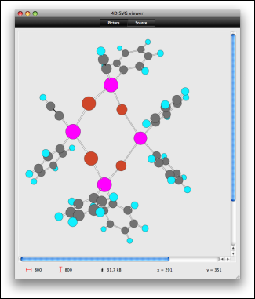

# SVGTool_SHOW_IN_VIEWER

>**SVGTool_SHOW_IN_VIEWER** ( *svgObject* {; *sources*} )

| Parameter | Type |  | Description |
| --- | --- | --- | --- |
| svgObject | SVG_Ref | &#x1F852; | Reference of picture to be displayed |
| sources | String | &#x1F852; | Opens viewer directly on the source page |

#### Description 

The SVGTool\_SHOW\_IN\_VIEWER command displays the SVG picture specified by *svgObject* in an SVG Viewer window. This tool is provided with the SVG component:

If you pass the optional *sources* parameter (added in v14), the viewer is opened directly on the source page.

For more information about the SVG Viewer, please refer to the *Development tools* section.

#### See also 

*Development tools*  