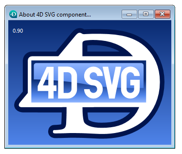

# SVG_ABOUT

>**SVG_ABOUT**

| Does not require any parameters |  |
| --- | --- |

#### Description 

The SVG\_ABOUT command displays a dialog with the 4D SVG logo indicating the version number of the component:

