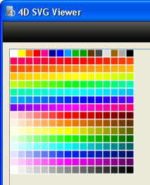

# SVG_Color_from_index

>**SVG_Color_from_index** ( *index* ) -> Function result

| Parameter | Type |  | Description |
| --- | --- | --- | --- |
| index | Longint | &#x1F852; | Number of color |
| Function result | Text field | &#x1F850; | Color designated by index |


#### Description 

The **SVG\_Color\_from\_index** returns the SVG color matching the 4D color specified in the *index* parameter.

The *index* parameter designates a number in the 4D color palette, where colors are numbered from 1 to 256\. For more information about this point, refer to the description of the 4D *\_o\_OBJECT SET COLOR* command. 

#### Example 

 In this example, we recreate the 4D color palette:

```4d
 $Dom_svg:=SVG_New
 $Lon_line:=0
 For($Lon_ii;0;15;1)
    $Lon_column:=0
    For($Lon_i;1;16;1)
       $Txt_color:=SVG_Color_from_index(($Lon_ii*16)+$Lon_i)
       $Dom_rect:=SVG_New_rect($Dom_svg;$Lon_column;
       $Lon_line;11;11;0;0;"white";$Txt_color)
       $Lon_column:=$Lon_column+11
    End for
    $Lon_line:=$Lon_line+11
 End for
 SVGTool_SHOW_IN_VIEWER($Dom_svg)
```



#### See also 

[SVG\_Color\_RGB\_from\_long](SVG%5FColor%5FRGB%5Ffrom%5Flong.md)  