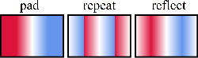
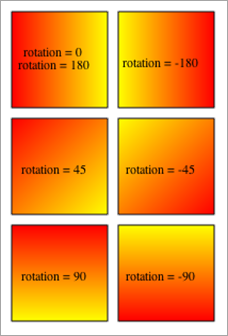
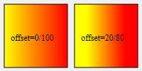

# SVG_Define_linear_gradient

>**SVG_Define_linear_gradient** ( *parentSVGObject* ; *id* ; *startColor* ; *endColor* {; *rotation* {; *spreadMethod* {; *x1* ; *y1* ; *x2* ; *y2*}{; *startColorOffset* ; *endColorOffset*}}} ) -> Function result

| Parameter | Type |  | Description |
| --- | --- | --- | --- |
| parentSVGObject | SVG_Ref | &#8594; | Reference of parent element |
| id | String | &#8594; | Name of gradient |
| startColor | String | &#8594; | Start color |
| endColor | String | &#8594; | End color |
| rotation | Integer | &#8594; | Rotation of gradient vector |
| spreadMethod | Text | &#8594; | Gradient spread method (pad, reflect or repeat) |
| x1 | Real | &#8594; | x1 coordinate of gradient vector (If omitted = 0) |
| y1 | Real | &#8594; | y1 coordinate of gradient vector (If omitted = 1) |
| x2 | Real | &#8594; | x2 coordinate of gradient vector (If omitted = 0) |
| y2 | Real | &#8594; | y2 coordinate of gradient vector (If omitted = 1) |
| startColorOffset | Real | &#8594; | Percentage value of offset for start color |
| endColorOffset | Real | &#8594; | Percentage value of offset for end color |
| Function result | String | &#8592; | Reference of gradient |


#### Description 

The **SVG\_Define\_linear\_gradient** command sets a new linear gradient in the SVG container designated by *parentSVGObject* and returns its reference. If *parentSVGObject* is not an SVG document, an error is generated.

A gradient consists in a continuous progressive color transition from one color to another along a vector. Once specified, gradients are called on a given graphic element, while indicating whether this element must be filled or edged with the gradient called.

The *id* parameter specifies the name of the gradient. If an element with the same name exists, it will be replaced. This is the name that will be used to call the gradient each time a that a color expression is expected by using the syntax "url(#ID)".

The *startColor* and *endColor* parameters specify the colors used to begin and end the gradient.

The optional *rotation* parameter sets the position and direction of the gradient vector (see example).

The optional *spreadMethod* parameter defines the filling to be used when the gradient begins or ends within the bounds of the *parentSVGObject*. You can pass one of the following strings in this parameter:

* "pad": use the terminal colors of the gradient to fill the remainder of the area.
* "reflect": reflect the gradient pattern start-to-end, end-to-start, start-to-end, etc. continuously until the object is filled.
* "repeat": repeat the gradient pattern start-to-end, start-to-end, start-to-end, etc. continuously until the object is filled.  


If this parameter is omitted, the "pad" value effect is used. 

The optional *x1*, *y1*, *x2* and *y2* parameters define the gradient vector. This vector provides the starting and ending points used by the rendering engine. You can pass percentages expressed as ratios (0...1) in these parameters. 

Starting with V14, you can pass the optional *startColorOffset* and *endColorOffset* parameters to define the percentage value, respectively, of the start color and end color offset. You can pass either a real value < 1, or a value between 0 and 100 to set the percentage, i.e. "0.1" and/or "10" are both interpreted as 10%.

Passing a negative value is interpreted as 0% for the *startColorOffset* parameter and as 100% for the *endColorOffset* parameter. If you pass a value > 100, it is interpreted as 100%.

#### Example 1 

Draw 6 solid squares where each uses a linear gradient paint server while varying the rotation and direction of the gradient vector:  


```4d
 $svg:=SVG_New
 
 SVG_Define_linear_gradient($svg;"demoGradient_1";"red";"yellow")
 SVG_New_rect($svg;10;10;90;90;0;0;"black";"url(#demoGradient_1)")
 SVG_New_text($svg;"rotation = 0\rrotation = 180";50;40;"";-1;-1;Align center)
 
 SVG_Define_linear_gradient($svg;"demoGradient_2";"red";"yellow";-180)
 SVG_New_rect($svg;110;10;90;90;0;0;"black";"url(#demoGradient_2)")
 SVG_New_text($svg;"rotation = -180";150;50;"";-1;-1;Align center)
 
 SVG_Define_linear_gradient($svg;"demoGradient_3";"red";"yellow";45)
 SVG_New_rect($svg;10;110;90;90;0;0;"black";"url(#demoGradient_3)")
 SVG_New_text($svg;"rotation = 45";50;150;"";-1;-1;Align center)
 
 SVG_Define_linear_gradient($svg;"demoGradient_4";"red";"yellow";-45)
 SVG_New_rect($svg;110;110;90;90;0;0;"black";"url(#demoGradient_4)")
 SVG_New_text($svg;"rotation = -45";150;150;"";-1;-1;Align center)
 
 SVG_Define_linear_gradient($svg;"demoGradient_5";"red";"yellow";90)
 SVG_New_rect($svg;10;210;90;90;0;0;"black";"url(#demoGradient_5)")
 SVG_New_text($svg;"rotation = 90";50;250;"";-1;-1;Align center)
 
 SVG_Define_linear_gradient($svg;"demoGradient_6";"red";"yellow";-90)
 SVG_New_rect($svg;110;210;90;90;0;0;"black";"url(#demoGradient_6)")
 SVG_New_text($svg;"rotation = -90";150;250;"";-1;-1;Align center)
 
  //Save document
 SVG_SAVE_AS_TEXT($svg;"test.svg")
  //Free up memory
 SVG_CLEAR($svg)
```

#### Example 2 

Example using the *startColorOffset* and *endColorOffset* parameters (added in v14):

```4d
 $Dom_node:=SVG_Define_linear_gradient($Dom_svg;"clicked";"black:50";"black:20";-90;"reflect";0;80)
```

will give the definition:

```XML
<linearGradient id="clicked spreadMethod="reflect x1="0" x2="0" y1="1" y2="0">
    <stop offset="0%" stop-color="black" stop-opacity="0.5"/>
    <stop offset="80%" stop-color="black" stop-opacity="0.2"/>
</linearGradient>
```

#### Example 3 

This example illustrates the effect of the *startColorOffset* and *endColorOffset* parameters:

```4d
 $svg:=SVG_New
 
 SVG_Define_linear_gradient($svg;"demoGradient_1";"red";"yellow";-180;"reflect")
 SVG_New_rect($svg;10;10;90;90;0;0;"black";"url(#demoGradient_1)")
 SVG_New_text($svg;"offset=0/100";50;50;"";-1;-1;Align center)
 
 SVG_Define_linear_gradient($svg;"demoGradient_2";"red";"yellow";-180;"reflect";20;80)
 SVG_New_rect($svg;110;10;90;90;0;0;"black";"url(#demoGradient_2)")
 SVG_New_text($svg;"offset=20/80";150;50;"";-1;-1;Align center)
  //Save document
 SVG_SAVE_AS_TEXT($svg;"test2.svg")
  //Free up memory
 SVG_CLEAR($svg)
```



#### See also 

*SVG Colors*  
[SVG\_Define\_radial\_gradient](SVG%5FDefine%5Fradial%5Fgradient.md)  