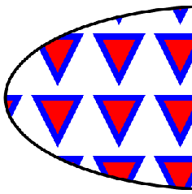
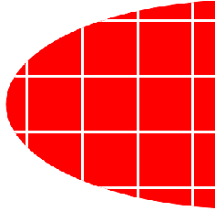

# SVG_Define_pattern

>**SVG_Define_pattern** ( *parentSVGObject* ; *patternID* {; *width* {; *height* {; *x* {; *y* {; *unit* {; *viewBox*}}}}}} ) -> Function result

| Parameter | Type |  | Description |
| --- | --- | --- | --- |
| parentSVGObject | SVG_Ref | &#x1F852; | Reference of parent element |
| patternID | Text | &#x1F852; | Name of pattern |
| width | Longint | &#x1F852; | Width of pattern |
| height | Longint | &#x1F852; | Height of pattern |
| x | Longint | &#x1F852; | Position X of pattern |
| y | Longint | &#x1F852; | Position Y of pattern |
| unit | Text | &#x1F852; | Unit of lengths and positions |
| viewBox | Text | &#x1F852; | Viewbox rectangle |
| Function result | SVG_Ref | &#x1F850; | Reference of pattern |


#### Description 

The SVG\_Define\_pattern command is used to set a new custom pattern in the SVG container designated by *parentSVGObject* and returns its reference. If *parentSVGObject* is not (or does not belong to) an SVG document, an error is generated.

The *patternID* parameter specifies the name of the pattern. This name will be used to associate the pattern with an object. If an element with the same name already exists, an error is generated.

The optional *width*, *height*, *x*, *y*, *unit* and *viewBox* parameters define the reference rectangle of the pattern, in other words, the way the pattern tiles will be placed and spaced.

The pattern will be associated as fill or stroke paint by passing the "url(#id)" string as the value when a color expression is expected.

**See Also:** *http://www.w3.org/TR/SVG/pservers.html#Patterns*

#### Example 1 

Setting a pattern and using it to fill an ellipse:  


```4d
  //Definition of pattern
 $Dom_pattern:=SVG_Define_pattern($Dom_SVG;"MyPattern";100;100;0;0;"";"0 0 10 10")
 $Dom_path:=SVG_New_path($Dom_pattern;0;0)
 
 SVG_PATH_MOVE_TO($Dom_path;0;0)
 SVG_PATH_LINE_TO($Dom_path;7;0)
 SVG_PATH_LINE_TO($Dom_path;3,5;7)
 SVG_PATH_CLOSE($Dom_path)
 SVG_SET_FILL_BRUSH($Dom_path;"red")
 SVG_SET_STROKE_BRUSH($Dom_path;"blue")
 
  //Drawing an ellipse filled with the pattern
 $Dom_ellipse:=SVG_New_ellipse($Dom_SVG;400;200;350;150;"black";"url(#MyPattern)";5)
```

#### Example 2 

Setting a pattern and using it to fill and stroke the outline of an ellipse:  


```4d
  //Definition of pattern
 $Dom_pattern:=SVG_Define_pattern($Dom_SVG;"MyPattern ";80;80;0;0;"";"0 0 20 20")
 $Dom_rect:=SVG_New_rect($Dom_pattern;0;0;20;20;0;0;"white";"red")
 
  //Drawing an ellipse
 $Dom_ellipse:=SVG_New_ellipse($Dom_SVG;400;200;350;150)
 
  //Using pattern for filling and outline
 SVG_SET_FILL_BRUSH($Dom_ellipse;"url(#MyPattern)")
 SVG_SET_STROKE_BRUSH($Dom_ellipse;"url(#MyPattern)")
```
