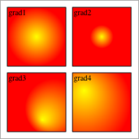

# SVG_Define_radial_gradient

>**SVG_Define_radial_gradient** ( *parentSVGObject* ; *id* ; *startColor* ; *endColor* {; *cx* ; *cy* ; *r* {; *fx* ; *fy*}} )  -> Function result

| Parameter | Type |  | Description |
| --- | --- | --- | --- |
| parentSVGObject | SVG_Ref | &#8594; | Reference of parent element |
| id | String | &#8594; | Name of gradient |
| startColor | String | &#8594; | Start color |
| endColor | String | &#8594; | End color |
| cx | Integer | &#8594; | Coordinate on X axis of center of endColor |
| cy | Integer | &#8594; | Coordinate on Y axis of center of endColor |
| r | Integer | &#8594; | Radius of endColor |
| fx | Integer | &#8594; | Coordinate on X axis of center of startColor |
| fy | Integer | &#8594; | Coordinate on Y axis of center of startColor |
| Function result | String | &#8592; | Reference of gradient |


#### Description 

The SVG\_Define\_radial\_gradient command sets a new radial gradient in the SVG container designated by *parentSVGObject* and returns its reference. If *parentSVGObject* is not an SVG document, an error is generated.

A gradient consists in a continuous progressive color transition from one color to another along a vector. Once specified, gradients are called on a given graphic element, while indicating whether this element must be filled or edged with the gradient called.

The *id* parameter specifies the name of the gradient. If an element with the same name exists, it will be replaced. This is the name that will be used to call the gradient each time a that a color expression is expected by using the syntax "url(#ID)".

The *startColor* and *endColor* parameters specify the colors used to begin and end the gradient.

The optional *cx*, *cy* and *r* parameters specify, in percent, the external border circle of the endColor of the gradient. Their values must be included between 0 and 100.

The optional *fx* and *fy* parameters specify, in percent, the focus point of the gradient. The *startColor* begins at the point \[*fx*,*fy*\]. Their values must be included between 0 and 100\. If these arguments are omitted, this point coincides with \[*cx*,*cy*\].

#### Example 



```4d
 $svg:=SVG_New
 
 SVG_Define_radial_gradient($svg;"grad1";"yellow";"red")
 SVG_New_rect($svg;10;10;90;90;0;0;"black";"url(#grad1)")
 SVG_New_text($svg;"grad1";12;10)
 
 SVG_Define_radial_gradient($svg;"grad2";"yellow";"red";50;50;20;50;50)
 SVG_New_rect($svg;110;10;90;90;0;0;"black";"url(#grad2)")
 SVG_New_text($svg;"grad2";112;10)
 
 SVG_Define_radial_gradient($svg;"grad3";"yellow";"red";80;60;50;60;80)
 SVG_New_rect($svg;10;110;90;90;0;0;"black";"url(#grad3)")
 SVG_New_text($svg;"grad3";12;110)
 
 SVG_Define_radial_gradient($svg;"grad4";"yellow";"red";20;50;80;20;30)
 SVG_New_rect($svg;110;110;90;90;0;0;"black";"url(#grad4)")
 SVG_New_text($svg;"grad4";112;110)
 
  //Save document
 SVG_SAVE_AS_TEXT($svg;"test.svg")
  //Free up memory
 SVG_CLEAR($svg)
```

#### See also 

*SVG Colors*  
[SVG\_Define\_linear\_gradient](SVG%5FDefine%5Flinear%5Fgradient.md)  