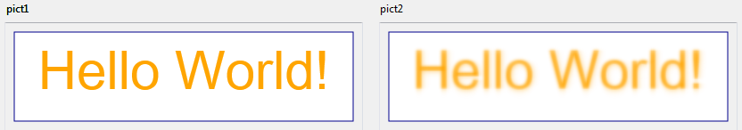
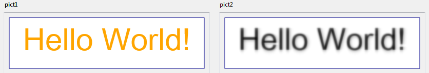

# SVG_Filter_Blur

>**SVG_Filter_Blur** ( *filterRef* ; *deviation* {; *input* {; *name*}} )  -> Function result

| Parameter | Type |  | Description |
| --- | --- | --- | --- |
| filterRef | SVG_Ref | &#x1F852; | Reference of filter |
| deviation | Real | &#x1F852; | Standard deviation for blur operation |
| input | String | &#x1F852; | Source of filter primitive |
| name | String | &#x1F852; | Target of filter primitive |
| Function result | SVG_Ref | &#x1F850; | Reference of primitive |


#### Description 

The SVG\_Filter\_Blur command sets a Gaussian blur for the *filterRef* filter and returns its reference. If *filterRef* is not a filter reference, an error is generated.

The *deviation* parameter can be used to set the standard deviation for the blur operation. If the number is an integer, the same deviation will be applied to the X and Y axes. If the number includes a decimal part, the integer part represents the deviation to be applied to the X axis and the decimal part represents the deviation to be applied to the Y axis.

The optional *input* parameter identifies the graphic source of the filter primitive. You can pass:

* either "sourceGraphic", indicating that the graphic is the filter source (default),
* or "sourceAlpha", which indicates that the alpha channel is the filter source.

The optional *name* parameter is the name, if any, assigned to the result of this filter primitive.

**Note:** Starting with 4D v14 R5, this command works under Windows with Direct2D enabled in software mode (see the Direct2D software constant in the description of the *SET DATABASE PARAMETER* command).

#### Example 

In a form, we display two identical SVG pictures then we create a "blur" filter and assign to the one on the right:

```4d
 $root:=SVG_New(400;400;"filters test") //definition of first (left) picture
 $rect:=SVG_New_rect($root;10;10;380;100;0;0;"darkblue";"white";1)
 SVG_SET_FILL_BRUSH($root;"orange")
 $textAreaRef:=SVG_New_textArea($root;"Hello World!";10;10;380;100;"arial";60;Normal;Align center)
 <>pict1:=SVG_Export_to_picture($root) //display first picture
 
 $root2:=SVG_New(400;400;"filters test") //definition of identical (right) picture
 
  //create filter
 $filter1:=SVG_Define_filter($root2;"blur")
  // filter definition
 $vGraph:=True //applied on graphic layer - pass False to apply to the alpha layer
 If($vGraph)
    SVG_Filter_Blur($filter1;Deviation{Deviation};"sourceGraphic")
 Else
    SVG_Filter_Blur($filter1;Deviation{Deviation};"sourceAlpha")
 End if
 
 $rect2:=SVG_New_rect($root2;10;10;380;100;0;0;"darkblue";"white";1) //definition of identical (right) picture
 SVG_SET_FILL_BRUSH($root2;"orange")
 $textAreaRef2:=SVG_New_textArea($root2;"Hello World!";10;10;380;100;"arial";60;Normal;Align center)
 
 SVG_SET_FILTER($textAreaRef2;"blur") //apply filter
 <>pict2:=SVG_Export_to_picture($root2) //display second picture
```

Result (input = sourceGraphic):  


Result (input = sourceAlpha):



#### See also 

[SVG\_Filter\_Blend](SVG%5FFilter%5FBlend.md)  
[SVG\_Filter\_Offset](SVG%5FFilter%5FOffset.md)  