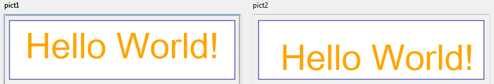

# SVG_Filter_Offset

>**SVG_Filter_Offset** ( *filterRef* ; *dx* {; *dy* {; *input* {; *name*}}} ) -> Function result

| Parameter | Type |  | Description |
| --- | --- | --- | --- |
| filterRef | SVG_Ref | &#8594; | Reference of filter |
| dx | Longint | &#8594; | Offset on X axis |
| dy | Longint | &#8594; | Offset on Y axis |
| input | String | &#8594; | Source of filter primitive |
| name | String | &#8594; | Target of filter primitive |
| Function result | SVG_Ref | &#8592; | Reference of primitive |


#### Description 

The SVG\_Filter\_Offset command sets an offset for the *filterRef* filter and returns its reference. If *filterRef* is not a filter reference, an error is generated.

The *dx* parameter is the value of the horizontal offset.

The optional *dy* parameter is the value of the vertical offset.

The optional *input* parameter identifies the graphic source of the filter primitive. You can pass:

* either "sourceGraphic", indicating that the graphic is the filter source (default),
* or "sourceAlpha", which indicates that the alpha channel is the filter source.

The optional *name* is the name, if any, assigned to the result of this filter primitive.

**Note:** Starting with 4D v14 R5, this command works under Windows with Direct2D enabled in software mode (see the Direct2D software constant in the description of the *SET DATABASE PARAMETER* command).

#### Example 

In a form, we display two identical SVG pictures then we create an "offset" filter and assign to the one on the right:

```4d
 $root:=SVG_New(400;400;"filters test") //definition of first (left) picture
 $rect:=SVG_New_rect($root;10;10;380;100;0;0;"darkblue";"white";1)
 SVG_SET_FILL_BRUSH($root;"orange")
 $textAreaRef:=SVG_New_textArea($root;"Hello World!";10;10;380;100;"arial";60;Normal;Align center)
 <>pict1:=SVG_Export_to_picture($root) //display first picture
 
 $root2:=SVG_New(400;400;"filters test") //definition of identical (right) picture
 $rect2:=SVG_New_rect($root2;10;10;380;100;0;0;"darkblue";"white";1)
 SVG_SET_FILL_BRUSH($root2;"orange")
 $textAreaRef2:=SVG_New_textArea($root2;"Hello World!";10;10;380;100;"arial";60;Normal;Align center)
 
 $filter:=SVG_Define_filter($root2;"Offset") //create filter
 SVG_Filter_Offset($filter;10;20)
 SVG_SET_FILTER($textAreaRef2;"Offset") //apply filter
 
 <>pict2:=SVG_Export_to_picture($root2) //display second picture
```

Result:



#### See also 

[SVG\_Filter\_Blend](SVG%5FFilter%5FBlend.md)  
[SVG\_Filter\_Blur](SVG%5FFilter%5FBlur.md)  