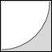
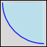

# SVG_New_arc

>**SVG_New_arc** ( *parentSVGObject* ; *x* ; *y* ; *radius* ; *start* ; *end* {; *foregroundColor* {; *backgroundColor* {; *strokeWidth*}}} ) -> Function result

| Parameter | Type |  | Description |
| --- | --- | --- | --- |
| parentSVGObject | SVG_Ref | &#x1F852; | Reference of parent element |
| x | Longint | &#x1F852; | Coordinate on center X axis |
| y | Longint | &#x1F852; | Coordinate on center Y axis |
| radius | Longint | &#x1F852; | Radius of circle |
| start | Longint | &#x1F852; | Value in degrees of start of arc |
| end | Longint | &#x1F852; | Value in degrees of end of arc |
| foregroundColor | String | &#x1F852; | Color or gradient name |
| backgroundColor | String | &#x1F852; | Color or gradient name |
| strokeWidth | Real | &#x1F852; | Line thickness |
| Function result | SVG_Ref | &#x1F850; | Reference of arc |


#### Description 

The SVG\_New\_arc command creates a new circle arc in the SVG container designated by *parentSVGObject* and returns its reference. If *parentSVGObject* is not an SVG document, an error is generated.

The optional *foregroundColor* and *backgroundColor* parameters contain, respectively, the name of the line color and of the background color. (For more information about colors, please refer to the commands of the *Colors and Gradients* theme).

The optional *strokeWidth* parameter contains the size of the pen expressed in pixels. Its default value is 1.

#### Example 1 

Draw an arc from 0° to 90° (default fill and border color, default line thickness):  


```4d
 svgRef:=SVG_New
 objectRef:=SVG_New_arc(svgRef;100;100;90;90;180)
```

#### Example 2 

Draw the arc from 90° to 180° of a light blue circle with a blue edge and a 2-point link thickness:  


```4d
 svgRef:=SVG_New
 objectRef:=SVG_New_arc(svgRef;100;100;90;180;270;"blue";"lightblue";2)
```

#### See also 

[SVG\_PATH\_ARC](SVG%5FPATH%5FARC.md)  