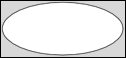
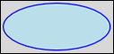

# SVG_New_ellipse

>**SVG_New_ellipse** ( *parentSVGObject* ; *x* ; *y* ; *xRadius* ; *yRadius* {; *foregroundColor* {; *backgroundColor* {; *strokeWidth*}}} ) -> Function result

| Parameter | Type |  | Description |
| --- | --- | --- | --- |
| parentSVGObject | SVG_Ref | &#x1F852; | Reference of parent element |
| x | Longint | &#x1F852; | Coordinate on center X axis of ellipse |
| y | Longint | &#x1F852; | Coordinate on center Y axis of ellipse |
| xRadius | Longint | &#x1F852; | Radius on X axis |
| yRadius | Longint | &#x1F852; | Radius on Y axis |
| foregroundColor | String | &#x1F852; | Color or gradient name |
| backgroundColor | String | &#x1F852; | Color or gradient name |
| strokeWidth | Real | &#x1F852; | Line thickness |
| Function result | SVG_Ref | &#x1F850; | Reference of ellipse |


#### Description 

The SVG\_New\_ellipse command creates a new ellipse in the SVG container designated by *parentSVGObject*. If *parentSVGObject* is not an SVG document, an error is generated.

The ellipse is positioned and sized according to the values of *x*, *y*, *width* and *height*.

The optional *foregroundColor* and *backgroundColor* parameters contain, respectively, the name of the line color and of the background color. (For more information about colors, please refer to the commands of the *Colors and Gradients* theme).

The optional *strokeWidth* parameter contains the size of the pen expressed in pixels. Its default value is 1.

#### Example 1 

Draw an ellipse (default fill and border color, default line thickness):  


```4d
 svgRef:=SVG_New
 objectRef:=SVG_New_ellipse(svgRef;100;50;90;40)
```

#### Example 2 

Draw a light blue ellipse with a blue edge and a 2-point line thickness:  


```4d
 svgRef:=SVG_New
 objectRef:=SVG_New_ellipse(svgRef;100;50;90;40;"blue";"lightblue";2)
```

#### See also 

[SVG\_New\_circle](SVG%5FNew%5Fcircle.md)  
[SVG\_New\_ellipse\_bounded](SVG%5FNew%5Fellipse%5Fbounded.md)  