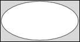
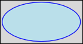

# SVG_New_ellipse_bounded

>**SVG_New_ellipse_bounded** ( *parentSVGObject* ; *x* ; *y* ; *width* ; *height* {; *foregroundColor* {; *backgroundColor* {; *strokeWidth*}}} ) -> Function result

| Parameter | Type |  | Description |
| --- | --- | --- | --- |
| parentSVGObject | SVG_Ref | &#8594; | Reference of parent element |
| x | Longint | &#8594; | Coordinate on X axis of upper left corner |
| y | Longint | &#8594; | Coordinate on Y axis of upper left corner |
| width | Longint | &#8594; | Width of bounding rectangle |
| height | Longint | &#8594; | Height of bounding rectangle |
| foregroundColor | String | &#8594; | Color or gradient name |
| backgroundColor | String | &#8594; | Color or gradient name |
| strokeWidth | Real | &#8594; | Line thickness |
| Function result | SVG_Ref | &#8592; | Reference of ellipse |


#### Description 

The SVG\_New\_ellipse\_bounded command creates a new ellipse in the SVG container designated by *parentSVGObject*. If *parentSVGObject* is not an SVG document, an error is generated.

The ellipse created fits into the rectangle set by *x*, *y*, *width* and *height*.

The optional *foregroundColor* and *backgroundColor* parameters contain, respectively, the name of the line color and of the background color. (For more information about colors, please refer to the commands of the *Colors and Gradients* theme).

The optional *strokeWidth* parameter contains the size of the pen expressed in pixels. Its default value is 1.

#### Example 1 

Draw an ellipse (default fill and border color, default line thickness):  


```4d
 svgRef:=SVG_New
 objectRef:=SVG_New_ellipse_bounded(svgRef;10;10;200;100)
```

#### Example 2 

Draw a light blue ellipse with a blue edge and a 2-point line thickness:  


```4d
 svgRef:=SVG_New
 objectRef:=SVG_New_ellipse_bounded(svgRef;100;100;200;100;"blue";"lightblue";2)
```

#### See also 

[SVG\_New\_ellipse](SVG_New_ellipse.md)  