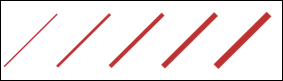
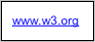

# SVG_New_group

>**SVG_New_group** ( *parentSVGObject* {; *id* {; *url* {; *target*}}} )  -> Function result

| Parameter | Type |  | Description |
| --- | --- | --- | --- |
| parentSVGObject | SVG_Ref | &#8594; | Reference of parent element |
| id | String | &#8594; | Name of group |
| url | String | &#8594; | External link |
| target | String | &#8594; | Target of link |
| Function result | SVG_Ref | &#8592; | Reference of group |


#### Description 

The SVG\_New\_group command creates a group in the SVG container designated by *parentSVGObject* and returns its reference. If *parentSVGObject* is not a valid SVG group or document, an error is generated.

The group ('g' element) can be used to group together several linked graphic elements, which will inherit the properties of the group.

The optional *id* parameter can be used to assign a name to the group. Named groups are necessary for several purposes such as animation and reusable objects.

The optional *url* parameter can be used to associate an external link. Group objects are then clickable (similar to the 'a' element of HTML).

The optional *target* parameter specifies the name of the target where the document will open when the link is activated. The values expected are those of the HTML specification to which are added the 'new' value for opening a new window and the 'none' value which is equivalent to not processing this attribute.

**Note:** External links are ignored when the SVG is displayed in a picture object (variable or field) of a 4D form. Management of external references is handled by the rendering engine. Under these conditions, the result may depend on the platform and the viewing software.

#### Example 1 

A group of lines, all the same color:  
   

```4d
 $SVG:=SVG_New
 $group:=SVG_New_group($SVG)
  //Assign a color to the group elements
 SVG_SET_STROKE_BRUSH($group;"firebrick")
 $newobject:=SVG_New_line($group;100;300;300;100;"";5)
 $newobject:=SVG_New_line($group;300;300;500;100;"";10)
 $newobject:=SVG_New_line($group;500;300;700;100;"";15)
 $newobject:=SVG_New_line($group;700;300;900;100;"";20)
 $newobject:=SVG_New_line($group;900;300;1100;100;"";25)
```

#### Example 2 

Clickable text:  
  

```4d
 $SVG:=SVG_New
 $group:=SVG_New_group($SVG;"w3Link";"http://www.w3.org";"new")
 $newobject:=SVG_New_text($group;"www.w3.org";10;10;"arial";12;Underline;Align left;"blue")
```
