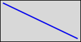

# SVG_New_line

>**SVG_New_line** ( *parentSVGObject* ; *startX* ; *startY* ; *endX* ; *endY* {; *color* {; *strokeWidth*}} ) -> Function result

| Parameter | Type |  | Description |
| --- | --- | --- | --- |
| parentSVGObject | SVG_Ref | &#x1F852; | Reference of parent element |
| startX | Longint | &#x1F852; | Horizontal start position |
| startY | Longint | &#x1F852; | Vertical start position |
| endX | Longint | &#x1F852; | Horizontal end position |
| endY | Longint | &#x1F852; | Vertical end position |
| color | String | &#x1F852; | Color or gradient name |
| strokeWidth | Real | &#x1F852; | Line thickness |
| Function result | SVG_Ref | &#x1F850; | Reference of line |


#### Description 

The SVG\_New\_line command creates a new line in the SVG container designated by *parentSVGObject* and returns its reference. The object is positioned according to the *startX*, *startY*, *endX* and *endY* coordinates. The SVG container can be the document root or any other reference to an SVG object that can contain this type of element.

The optional *color* parameter contains the name of the line color. (For more information about colors, please refer to the commands of the *Colors and Gradients* theme).

The optional *strokeWidth* parameter contains the pen size expressed in pixels. Its default value is 1.

#### Example 

Draw a blue line that is 3 pixels thick:



```4d
 svgRef:=SVG_New
 objectRef:=SVG_New_line(svgRef;10;10;200;100;"blue";3)
```

#### See also 

[SVG\_New\_polyline](SVG%5FNew%5Fpolyline.md)  
[SVG\_PATH\_LINE\_TO](SVG%5FPATH%5FLINE%5FTO.md)  