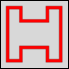
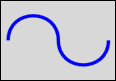
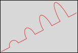
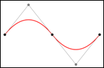

# SVG_New_path

>**SVG_New_path** ( *parentSVGObject* ; *x* ; *y* {; *foregroundColor* {; *backgroundColor* {; *strokeWidth*}}} ) -> Function result

| Parameter | Type |  | Description |
| --- | --- | --- | --- |
| parentSVGObject | SVG_Ref | &#8594; | Reference of parent element |
| x | Longint | &#8594; | Coordinate on X axis of start of path |
| y | Longint | &#8594; | Coordinate on Y axis of start of path |
| foregroundColor | String | &#8594; | Color or gradient name |
| backgroundColor | String | &#8594; | Color or gradient name |
| strokeWidth | Real | &#8594; | Line thickness |
| Function result | SVG_Ref | &#8592; | SVG object reference |


#### Description 

The SVG\_New\_path command starts a new path in the SVG container designated by *parentSVGObject* and returns its reference. If *parentSVGObject* is not an SVG document, an error is generated.

A path represents the outline of a shape. A path is depicted by calling upon the concept of a current point. By analogy with a drawing on paper, the current point can be assimilated to the position of the pen. This point can change and the outline of a shape (open or closed) can be traced by moving the pen along a straight or curved line.  
Paths represent the geometry of the outline of an object, defined according to the statements of the following elements: *SVG\_PATH\_MOVE\_TO* (etablish a new current point), *SVG\_PATH\_LINE\_TO* (draw a straight line), *SVG\_PATH\_CURVE* (draw a curve using a cubic Bezier curve), *SVG\_PATH\_ARC* (draw a circular or elliptical arc) and *SVG\_PATH\_CLOSE* (close the current form by drawing a line to the last beginning of the path). It is possible to have compound paths (in other words, a path with several subpaths) that can be used for effects such as a "doughnut hole" in objects.

The *x* and *y* parameters can be used to specify the start position of a path in the SVG container.

The optional *foregroundColor* and *backgroundColor* parameters contain, respectively, the name of the line color and of the background color. (For more information about colors, please refer to the commands of the *Colors and Gradients* theme).

The optional *strokeWidth* parameter contains the size of the pen expressed in pixels. Its default value is 1.

#### Example 1 

Draw a closed broken line:  


```4d
 svgRef:=SVG_New
 objectRef:=SVG_New_path(svgRef;20;20;"red";"none";5)
 SVG_PATH_LINE_TO(objectRef;40)
 SVG_PATH_LINE_TO(objectRef;40;40)
 SVG_PATH_LINE_TO(objectRef;80;40;80;20;100;20;100;100;80;100;80;80;40;80;40;100;20;100)
 SVG_PATH_CLOSE(objectRef)
```

#### Example 2 

Draw a Bezier curve:  


```4d
 svgRef:=SVG_New
 objectRef:=SVG_New_path(svgRef;100;200;"aquamarine";"none";10)
 SVG_PATH_CURVE(objectRef;250;200;100;100;250;100)
 SVG_PATH_CURVE(objectRef;400;200;400;300)
```

#### Example 3 

Arc commands in path data:  


```4d
 svgRef:=SVG_New
 objectRef:=SVG_New_path(svgRef;20;300;"red";"none";2)
 SVG_SET_OPTIONS(SVG_Get_options?-4) //Change to relative coordinates
 SVG_PATH_LINE_TO(objectRef;50;-25)
 For($Lon_i;1;4;1)
    SVG_PATH_ARC(objectRef;25;25*$Lon_i;50;-25;-30)
    SVG_PATH_LINE_TO(objectRef;50;-25)
 End for
```

#### Example 4 

Complex path (cubic Bezier curve):  
 

```4d
  //Create a new SVG tree
 $Txt_svg:=SVG_New(174,96;125,04;"4D Logo";"";True)
 
  //Create a new path
 $Txt_path:=SVG_New_path($Txt_svg;150,665;13,021)
  //Set colors
 SVG_SET_STROKE_BRUSH($Txt_path;"#212a6f")
 SVG_SET_FILL_BRUSH($Txt_path;"#212a6f")
 ...
 SVG_PATH_CURVE($Txt_path;-9,683;-6,54;-20,842;-8,888;-33,06;-10,462)
 SVG_PATH_CURVE($Txt_path;-7,042;-0,915;-14,587;-0,877;-22,087;-0,877)
 SVG_PATH_CURVE($Txt_path;-1,725;0;-4,312;-0,405;-5,761;0,24)
 SVG_PATH_CURVE($Txt_path;-1,762;0;-5,092;-0,382;-6,479;0,24)
 ...
 SVG_PATH_CURVE($Txt_path;181,489;70,216;177,236;30,976;150,665;13,021)
 SVG_PATH_MOVE_TO($Txt_path;146,03;98,078)
 ...
 SVG_PATH_CURVE($Txt_path;153,11;78,668;151,407;89,558;146,03;98,078)
```

#### Example 5 

Quadratic Bezier curve:  


```4d
  //Create a new SVG tree
 $svg:=SVG_New
 
  //Reset stroke to black and set fill to none
 SVG_SET_DEFAULT_BRUSHES("";"none")
 
  //Draw a quadratic Bezier curve in red
 $qCurve:=SVG_New_path($svg;200;300)
 SVG_SET_STROKE_BRUSH($qCurve;"red")
 SVG_SET_STROKE_WIDTH($qCurve;5)
 SVG_PATH_QCURVE($qCurve;400;50;600;300)
 SVG_PATH_QCURVE($qCurve;1000;300)
 
  //End points in black
 $g:=SVG_New_group($svg)
 SVG_Set_description($g;"End points")
 SVG_SET_DEFAULT_BRUSHES("black";"black")
 SVG_New_circle($g;200;300;10)
 SVG_New_circle($g;600;300;10)
 SVG_New_circle($g;1000;300;10)
 
  //Control points and lines from end points to control points in gray
 $g:=SVG_New_group($svg)
 SVG_Set_description($g;"Control points and lines from end points to control points")
 SVG_SET_DEFAULT_BRUSHES(SVG_Color_grey(50);"none")
 $path:=SVG_New_path($svg;200;300)
 SVG_SET_STROKE_WIDTH($path;2)
 SVG_PATH_LINE_TO($path;400;50;600;300;800;550;1000;300)
 $gray:=SVG_Color_grey(50) //grey 50%
 SVG_SET_DEFAULT_BRUSHES($gray;$gray)
 SVG_New_circle($g;400;50;10)
 SVG_New_circle($g;800;550;10)
```

#### See also 

[SVG\_PATH\_CLOSE](SVG%5FPATH%5FCLOSE.md)  
[SVG\_PATH\_LINE\_TO](SVG%5FPATH%5FLINE%5FTO.md)  