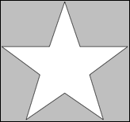

# SVG_New_polygon_by_arrays

>**SVG_New_polygon_by_arrays** ( *parentSVGObject* ; *xArrayPointer* ; *yArrayPointer* {; *foregroundColor* {; *backgroundColor* {; *strokeWidth*}}} ) -> Function result

| Parameter | Type |  | Description |
| --- | --- | --- | --- |
| parentSVGObject | SVG_Ref | &#8594; | Reference of parent element |
| xArrayPointer | Pointer | &#8594; | Coordinates on X axis of points |
| yArrayPointer | Pointer | &#8594; | Coordinates on Y axis of points |
| foregroundColor | String | &#8594; | Color or gradient name |
| backgroundColor | String | &#8594; | Color or gradient name |
| strokeWidth | Real | &#8594; | Line thickness |
| Function result | SVG_Ref | &#8592; | Reference of polygon |


#### Description 

The SVG\_New\_polygon\_by\_arrays command draws a closed form consisting of a set of straight connected segments in the SVG container designated by *parentSVGObject* and returns its reference. If *parentSVGObject* is not an SVG document, an error is generated.

All the coordinate values are in the user coordinate system.

The optional *foregroundColor* and *backgroundColor* parameters contain, respectively, the name of the line color and of the background color. (For more information about colors, please refer to the commands of the *Colors and Gradients* theme).

The optional *strokeWidth* parameter contains the size of the pen expressed in pixels. Its default value is 1.

#### Example 

Draw a star (default border color and line thickness):  


```4d
 ARRAY LONGINT($tX;0)
 ARRAY LONGINT($tY;0)
 
 APPEND TO ARRAY($tX;129)
 APPEND TO ARRAY($tY;10)
 APPEND TO ARRAY($tX;158)
 APPEND TO ARRAY($tY;96)
 APPEND TO ARRAY($tX;248)
 APPEND TO ARRAY($tY;96)
 APPEND TO ARRAY($tX;176)
 APPEND TO ARRAY($tY;150)
 APPEND TO ARRAY($tX;202)
 APPEND TO ARRAY($tY;236)
 APPEND TO ARRAY($tX;129)
 APPEND TO ARRAY($tY;185)
 APPEND TO ARRAY($tX;56)
 APPEND TO ARRAY($tY;236)
 APPEND TO ARRAY($tX;82)
 APPEND TO ARRAY($tY;150)
 APPEND TO ARRAY($tX;10)
 APPEND TO ARRAY($tY;96)
 APPEND TO ARRAY($tX;100)
 APPEND TO ARRAY($tY;96)
 
 objectRef:=SVG_New_polygon_by_arrays(svgRef;->$tX;->$tY)
```

#### See also 

[SVG\_New\_polygon](SVG_New_polygon.md)  
[SVG\_New\_regular\_polygon](SVG_New_regular_polygon.md)  