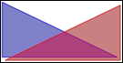

# SVG_New_polyline

>**SVG_New_polyline** ( *parentSVGObject* {; *points* {; *foregroundColor* {; *backgroundColor* {; *strokeWidth*}}}} ) -> Function result

| Parameter | Type |  | Description |
| --- | --- | --- | --- |
| parentSVGObject | SVG_Ref | &#8594; | Reference of parent element |
| points | String | &#8594; | Path |
| foregroundColor | String | &#8594; | Color or gradient name |
| backgroundColor | String | &#8594; | Color or gradient name |
| strokeWidth | Real | &#8594; | Line thickness |
| Function result | SVG_Ref | &#8592; | Reference of line |


#### Description 

The SVG\_New\_polyline command creates a new open broken line in the SVG container designated by *parentSVGObject* and returns its reference. If *parentSVGObject* is not a valid reference, an error is generated.

The optional *points* parameter can be used to pass the path points of the line as expected by the SVG standard. If this parameter is omitted or empty, the points may be set with the *SVG\_ADD\_POINT* command.

The optional *foregroundColor* and *backgroundColor* parameters contain, respectively, the name of the line color and of the background color. (For more information about colors, please refer to the commands of the *Colors and Gradients* theme).

The optional *strokeWidth* parameter contains the size of the pen expressed in pixels. Its default value is 1.

#### Example 

Draw two triangles:  


```4d
 $polyline:=SVG_New_polyline($svg;"10,10 200,100 10,100 10,10";"blue";"blue:50")
 $polyline:=SVG_New_polyline($svg;"";"red";"red:50")
 SVG_ADD_POINT($polyline;205;15)
 SVG_ADD_POINT($polyline;15;105)
 SVG_ADD_POINT($polyline;205;105)
 SVG_ADD_POINT($polyline;205;15)
```

#### See also 

[SVG\_New\_polyline\_by\_arrays](SVG_New_polyline_by_arrays.md)  