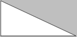
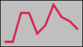

# SVG_New_polyline_by_arrays

>**SVG_New_polyline_by_arrays** ( *parentSVGObject* ; *xArrayPointer* ; *yArrayPointer* {; *foregroundColor* {; *backgroundColor* {; *strokeWidth*}}} ) -> Function result

| Parameter | Type |  | Description |
| --- | --- | --- | --- |
| parentSVGObject | SVG_Ref | &#x1F852; | Reference of parent element |
| xArrayPointer | Pointer | &#x1F852; | Coordinates on X axis of points |
| yArrayPointer | Pointer | &#x1F852; | Coordinates on Y axis of points |
| foregroundColor | String | &#x1F852; | Color or gradient name |
| backgroundColor | String | &#x1F852; | Color or gradient name |
| strokeWidth | Real | &#x1F852; | Line thickness |
| Function result | SVG_Ref | &#x1F850; | Reference of line |


#### Description 

The SVG\_New\_polyline\_by\_arrays command draws a broken line composed of straight segments connected together in the SVG container designated by *parentSVGObject* and returns its reference. If *parentSVGObject* is not an SVG document, an error is generated.

Usually, 'polyline' elements design open forms but they can be used for closed forms as well. In this case the last point must be set as equal to the first.

All the coordinate values are in the user coordinate system.

The optional *foregroundColor* and *backgroundColor* parameters contain, respectively, the name of the line color and of the background color. (For more information about colors, please refer to the commands of the *Colors and Gradients* theme).

The optional *strokeWidth* parameter contains the size of the pen expressed in pixels. Its default value is 1.

#### Example 1 

Draw a triangle (default border color and line thickness):  


```4d
 ARRAY LONGINT($tX;0)
 ARRAY LONGINT($tY;0)
 
 APPEND TO ARRAY($tX;10)
 APPEND TO ARRAY($tY;10)
 APPEND TO ARRAY($tX;200)
 APPEND TO ARRAY($tY;100)
 APPEND TO ARRAY($tX;10)
 APPEND TO ARRAY($tY;100)
 APPEND TO ARRAY($tX;10)
 APPEND TO ARRAY($tY;10)
 
 svgRef:=SVG_New
 objectRef:=SVG_New_polyline_by_arrays(svgRef;->$tX;->$tY)
```

#### Example 2 

Draw a line diagram:  


```4d
 ARRAY LONGINT($tX;0)
 ARRAY LONGINT($tY;0)
  //X axis
 For($Lon_i;0;200;20)
    APPEND TO ARRAY($tX;$Lon_i)
 End for
  //Values
 APPEND TO ARRAY($tY;100)
 APPEND TO ARRAY($tY;100)
 APPEND TO ARRAY($tY;30)
 APPEND TO ARRAY($tY;30)
 APPEND TO ARRAY($tY;80)
 APPEND TO ARRAY($tY;60)
 APPEND TO ARRAY($tY;10)
 APPEND TO ARRAY($tY;40)
 APPEND TO ARRAY($tY;50)
 APPEND TO ARRAY($tY;70)
 
 objectRef:=SVG_New_polyline_by_arrays(svgRef;->$tX;->$tY;"crimson";"none";5)
```

#### See also 

[SVG\_New\_polyline](SVG%5FNew%5Fpolyline.md)  