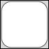

# SVG_New_rect

>**SVG_New_rect** ( *parentSVGObject* ; *x* ; *y* ; *width* ; *height* {; *roundedX* {; *roundedY* {; *foregroundColor* {; *backgroundColor* {; *strokeWidth*}}}}} )  -> Function result

| Parameter | Type |  | Description |
| --- | --- | --- | --- |
| parentSVGObject | SVG_Ref | &#x1F852; | Reference of parent element |
| x | Longint | &#x1F852; | X of upper left corner |
| y | Longint | &#x1F852; | Y of upper left corner |
| width | Longint | &#x1F852; | Width of rectangle |
| height | Longint | &#x1F852; | Height of rectangle |
| roundedX | Longint | &#x1F852; | Horizontal curve |
| roundedY | Longint | &#x1F852; | Vertical curve |
| foregroundColor | String | &#x1F852; | Color or gradient name |
| backgroundColor | String | &#x1F852; | Color or gradient name |
| strokeWidth | Real | &#x1F852; | Line thickness |
| Function result | SVG_Ref | &#x1F850; | Reference of rectangle |


#### Description 

The SVG\_New\_rect command creates a new rectangle in the SVG container designated by *parentSVGObject* and returns its reference. If *parentSVGObject* is not an SVG document, an error is generated.

The rectangle is positioned and sized according to the values of *x*, *y*, *width* and *height*.

The optional *roundedX* and *roundedY* parameters can be used to round off the angles according to the indicated values. If the *roundedY* parameter is omitted (or is -1), the curve will be regular. Pass -1 in these parameters if you want them to be ignored by the command.

The optional *foregroundColor* and *backgroundColor* parameters contain, respectively, the name of the line color and of the background color. (For more information about colors, please refer to the commands of the *Colors and Gradients* theme).

The optional *strokeWidth* parameter contains the size of the pen expressed in pixels. Its default value is 1.

#### Example 1 

Draw a rectangle (default fill and border color, default line thickness):


```4d
 svgRef:=SVG_New
 objectRef:=SVG_New_rect(svgRef;10;10;200;100)
```

#### Example 2 

Draw a blue rectangle with a 3-pixel red border:

svgRef:= SVG\_New  
objectRef:=SVG\_New\_rect (svgRef;10;10;200;100;0;0;"red";"blue";3)

#### Example 3 

Draw a square with rounded edges (default fill and border color, default line thickness):



```4d
 svgRef:=SVG_New
 objectRef:=SVG_New_rect(svgRef;10;10;100;100;20)
```

#### Example 4 

Draw a light blue rectangle with rounded ends and a blue edge (default line thickness):


```4d
 svgRef:=SVG_New
 objectRef:=SVG_New_rect(svgRef;10;10;200;100;-1;50;"blue";"lightblue")
```

#### See also 

[SVG\_New\_polygon](SVG%5FNew%5Fpolygon.md)  
[SVG\_SET\_ROUNDING\_RECT](SVG%5FSET%5FROUNDING%5FRECT.md)  