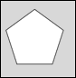
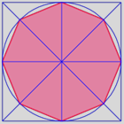

# SVG_New_regular_polygon

>**SVG_New_regular_polygon** ( *parentSVGObject* ; *width* ; *number* {; *x* {; *y* {; *foregroundColor* {; *backgroundColor* {; *strokeWidth*}}}}} ) -> Function result

| Parameter | Type |  | Description |
| --- | --- | --- | --- |
| parentSVGObject | SVG_Ref | &#x1F852; | Reference of parent element |
| width | Longint | &#x1F852; | Diameter of surrounding circle |
| number | Longint | &#x1F852; | Number of sides |
| x | Longint | &#x1F852; | Coordinate on center X axis |
| y | Longint | &#x1F852; | Coordinate on center Y axis |
| foregroundColor | String | &#x1F852; | Color or gradient name |
| backgroundColor | String | &#x1F852; | Color or gradient name |
| strokeWidth | Real | &#x1F852; | Line thickness |
| Function result | SVG_Ref | &#x1F850; | Reference of polygon |


#### Description 

The SVG\_New\_regular\_polygon command draws a regular polygon with number of sides fit into a circle with a diameter of *width* in the SVG container designated by *parentSVGObject* and returns its reference. If *parentSVGObject* is not an SVG document, an error is generated.

The optional *x* and *y* parameters can be used to specify the center of the circle. If they are omitted, the figure will be drawn in the upper left corner of the document.

The optional *foregroundColor* and *backgroundColor* parameters contain, respectively, the name of the line color and of the background color. (For more information about colors, please refer to the commands of the *Colors and Gradients* theme).

The optional *strokeWidth* parameter contains the size of the pen expressed in pixels. Its default value is 1.

#### Example 1 

Draw a pentagon (default fill and border color, default line thickness):  


```4d
 svgRef:=SVG_New
 objectRef:=SVG_New_regular_polygon(svgRef;100;5)
```

#### Example 2 

Draw an octogon, the circle containing it and the trace lines:  


```4d
 svgRef:=SVG_New
 $width:=200
 $sides:=8
 objectRef:=SVG_New_regular_polygon(svgRef;$width;$sides;0;0;"crimson";"palevioletred";2)
 
 $radius:=$width/2
 objectRef:=SVG_New_rect(svgRef;0;0;$width;$width;0;0;"blue";"none")
 objectRef:=SVG_New_line(svgRef;0;$radius;$width;$radius;"blue")
 objectRef:=SVG_New_line(svgRef;$radius;0;$radius;$width;"blue")
 objectRef:=SVG_New_line(svgRef;0;0;$width;$width;"blue")
 objectRef:=SVG_New_line(svgRef;$width;0;0;$width;"blue")
 objectRef:=SVG_New_circle(svgRef;$radius;$radius;$radius;"blue";"none")
```

#### See also 

[SVG\_New\_polygon](SVG%5FNew%5Fpolygon.md)  