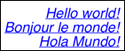
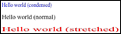

# SVG_New_text

>**SVG_New_text** ( *parentSVGObject* ; *text* {; *x* {; *y* {; font | styleDef  {; *size* {; *style* {; *alignment* {; *color* {; *rotation* {; *lineSpacing* {; *stretching*}}}}}}}}}} )  -> Function result

| Parameter | Type |  | Description |
| --- | --- | --- | --- |
| parentSVGObject | SVG_Ref | &#x1F852; | Reference of parent element |
| text | Text | &#x1F852; | Text to insert |
| x | Real | &#x1F852; | Coordinate on X axis |
| y | Real | &#x1F852; | Coordinate on Y axis |
| font &#124; styleDef | Text | &#x1F852; | Font name or Style definition |
| size | Longint | &#x1F852; | Size of characters in points |
| style | Longint | &#x1F852; | Style of characters |
| alignment | Longint | &#x1F852; | Alignment |
| color | String | &#x1F852; | Text color |
| rotation | Real | &#x1F852; | Angle of rotation of text |
| lineSpacing | Real | &#x1F852; | Line spacing in points |
| stretching | Real | &#x1F852; | Horizontal stretch factor |
| Function result | SVG_Ref | &#x1F850; | Reference of SVG text object |


#### Description 

The **SVG\_New\_text** command inserts the text in text in the SVG container designated by *parentSVGObject* and returns its reference. If *parentSVGObject* is not an SVG document, an error is generated.

**Note:** Starting with 4D v15, the **SVG\_New\_text** command supports simple Styled text (the text can contain different styles, but SPAN attributes must not be nested). See example 5.

The optional *x* and *y* parameters can be used to specify the position on the X and Y axis of the upper corner of the first character of text. This point is situated differently according to the alignment value: to the left for a left alignment, to the right for a right alignment or in the center when the text is centered.

The **SVG\_New\_text** command accepts two different syntaxes for setting characters:

* You can pass various values in the *font*, *size*, *style* and *alignment* parameters: *font* and *size* can be used to specify the font and size, in points, to be used. When these parameters are omitted, the text will be written in Times New Roman 12 pts.  
The optional *style* parameter gives information about the character style used. In the *style* parameter, you must pass one of the following values or a combination of several of them (or you can also use the corresponding 4D constants from the *Font Styles* theme):  
> 0 = Plain  
> 1 = Bold  
> 2 = Italic  
> 4 = Underline  
> 8 = Strikethrough  
The optional *alignment* parameter can be used to set the type of alignment to be applied to the drawn text. You can pass one of the following values:  
> 2 = Align left  
> 3 = Center  
> 4 = Align right  
The optional *color* parameter contains the name of the font color. (For more information about colors, please refer to the *Colors and Gradients* section).  
The optional *rotation* parameter can be used to specify the rotation to be applied to the text.  
The optional *lineSpacing* parameter can be used to specify the value of the line spacing if the text has more than one line. Default value = 1.  
The optional *stretching* parameter can be used to specify a horizontal stretching (value >1) or condensing (value included between 0 and 1) factor of the text.
* Or you can pass a style definition in the *styleDef* parameter (instead of the *font* parameter) and then omit the following parameters. For example, you can pass:  
```4d  
 SVG_New_textArea($Dom_svg;"Hello World !";x;y;vWidth;vHeight;style_definition)  
```  
    
... where the *style\_definition* parameter contains a complete style definition. If you pass, for instance, "{font-size:48px;fill:red;}", this definition is added as a style attribute in the form:  
```XML  
style="font-size:48px;fill:red;"  
```  
    
In this case, any additional parameters are ignored.

#### Example 1 

Simple text using default text properties:  


```4d
 $SVG:=SVG_New
 $textID:=SVG_New_text($SVG;"Hello world!")
```

#### Example 2 

Text that is blue, italic, underlined and aligned to the right:  


```4d
 $SVG:=SVG_New
 $text:="Hello world!\rBonjour le monde!\rHola Mundo!"
 $size:=48
 $font:="helvetica"
 $textID:=SVG_New_text($SVG;$text;400;10;$font;$size;Italic+Underline;Align right;"blue")
```

#### Example 3 

Vertical text:  


```4d
 $SVG:=SVG_New
 $textID:=SVG_New_text($SVG;$text;-250;0;"";48;-1;-1;"red";-90)
```

#### Example 4 

Condensed or expanded text:  


```4d
 $SVG:=SVG_New
 $textID:=SVG_New_text($SVG;"Hello world (condensed)";0;0;"";-1;-1;-1;"blue";0;1;0,8)
 $textID:=SVG_New_text($SVG;"Hello world (normal)";0;24)
 $textID:=SVG_New_text($SVG;"Hello world (stretched)";0;48;"";-1;-1;-1;"red";0;1;2)
```

#### Example 5 

Display of multi-style text:

```4d
 var $Dom_svg;$Dom_text;$Txt_buffer : Text
  //definition of multi-style text
 $Txt_buffer:="Hello "+\
 "World"+\
 "!
"+\
 "It's "+\
 "Monday"
 $Dom_svg:=SVG_New
 
  //title
 SVG_SET_FONT_COLOR(SVG_New_text($Dom_svg;"_______ svg_Newtext _______";10;30);"blue")
  //text
 $Dom_text:=SVG_New_text($Dom_svg;$Txt_buffer;50;50)
 
 SVGTool_SHOW_IN_VIEWER($Dom_svg)
 SVG_CLEAR($Dom_svg)
```


#### See also 

[SVG\_New\_textArea](SVG%5FNew%5FtextArea.md)  
[SVG\_New\_tspan](SVG%5FNew%5Ftspan.md)  
[SVG\_New\_vertical\_text](SVG%5FNew%5Fvertical%5Ftext.md)  