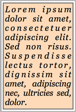

# SVG_New_textArea

>**SVG_New_textArea** ( *parentSVGObject* ; *text* {; *x* {; *y* {; *textWidth* {; *textHeight* {; font | styleDef {; *size* {; *style* {; *alignment*}}}}}}}} )  -> Function result

| Parameter | Type |  | Description |
| --- | --- | --- | --- |
| parentSVGObject | SVG_Ref | &#8594; | Reference of parent element |
| text | Text | &#8594; | Text to insert |
| x | Longint | &#8594; | Coordinate on X axis |
| y | Longint | &#8594; | Coordinate on Y axis |
| textWidth | Longint | &#8594; | Width of text area |
| textHeight | Longint | &#8594; | Height of text area |
| font &#124; styleDef | Text | &#8594; | Font name or Style definition |
| size | Integer | &#8594; | Size of characters in points |
| style | Integer | &#8594; | Style of characters |
| alignment | Integer | &#8594; | Alignment |
| Function result | SVG_Ref | &#8592; | Reference of SVG text object |


#### Description 

The **SVG\_New\_textArea** command inserts a text area in the SVG container designated by *parentSVGObject* and returns its reference. If *parentSVGObject* is not an SVG document, an error is generated.

The "textArea" element is recommended by the SVG tiny 1.2 standard and implemented in 4D v11 SQL beginning with version 11.3 (see *http://www.w3.org/TR/SVGMobile12/text.html#TextAreaElement*). This element implements a text area that, unlike the "text" element, automatically handles the line feed when the text exceeds the width requested.

**Notes:** 

* In the "textArea" element, <tbreak/> elements replace line returns.
* Starting with 4D v15, the **SVG\_New\_textArea** command supports simple Styled text (the text can contain different styles, but SPAN attributes must not be nested). See example 2.

The optional *x* and *y* parameters can be used to specify the position on the X and Y axes of the top left corner of the area.

The optional *textWidth* and *textHeight* parameters specify the size of the area in the user coordinate space. If one or the other of these parameters is not provided, the text area will automatically be fitted to its contents.

The **SVG\_New\_textArea** command accepts two different syntaxes for setting characters:

* You can pass various values in the *font* , *size* , *style* and *alignment* parameters: *font* and *size* can be used to specify the font and size, in points, to be used. When these parameters are omitted, the text will be written in Times New Roman 12 pts.  
The optional *style* parameter gives information about the character style used. In the *style* parameter, you must pass one of the following values or a combination of several of them (or you can also use the corresponding 4D constants from the *Font Styles* theme):  
    
> 0 = Plain  
> 1 = Bold  
> 2 = Italic  
> 4 = Underline  
> 8 = Strikethrough  
    
The optional *alignment* parameter can be used to set the type of alignment to be applied to the drawn text. You can pass one of the following values:  
> 1 = Align default (left)  
> 2 = Align left  
> 3 = Center  
> 4 = Align right  
> 5 = Justify
* Or you can pass a style definition in the *styleDef* parameter (instead of the *font* parameter) and then omit the following parameters. For example, you can pass:  
```4d  
 SVG_New_textArea($Dom_svg;"Hello World !";x;y;vWidth;vHeight;style_definition)  
```  
    
... where the *style\_definition* parameter contains a complete style definition. If you pass, for instance, "{font-size:48px;fill:red;}", this definition is added as a style attribute in the form:  
```XML  
style="font-size:48px;fill:red;"  
```  
    
In this case, any additional parameters are ignored.

#### Example 1 



```4d
 $svg:=SVG_New
  //Position a border rectangle
 $rec:=SVG_New_rect($svg;5;5;210;320;0;0;"#777";"peachpuff";3)
  //The text
 $txt:="Lorem ipsum dolor sit amet, consectetuer adipiscing elit. Sed non risus. Suspendisse lectus tortor, dignissim sit amet, adipiscing nec, ultricies sed, dolor."
 $txtArea:=SVG_New_textArea($svg;$txt;10;10;200;310;"Georgia";25;Italic;5)
  //Save document
 SVG_SAVE_AS_TEXT($svg;"test.svg")
```

#### Example 2 

Display of multi-style text:

```4d
 var $Dom_svg;$Dom_text;$Txt_buffer : Text
  //definition of multi-style text
 $Txt_buffer:="Hello "+\
 "World"+\
 "!
"+\
 "It's "+\
 "Monday"
 $Dom_svg:=SVG_New
 
  //title
 SVG_SET_FONT_COLOR(SVG_New_text($Dom_svg;"_______ SVG_New_textArea ______";10;30;"";-1);"blue")
  //textArea
 $Dom_text:=SVG_New_textArea($Dom_svg;$Txt_buffer;50;50)
 
 SVGTool_SHOW_IN_VIEWER($Dom_svg)
 SVG_CLEAR($Dom_svg)
```


#### See also 

[SVG\_APPEND\_TEXT\_TO\_TEXTAREA](SVG%5FAPPEND%5FTEXT%5FTO%5FTEXTAREA.md)  
[SVG\_New\_text](SVG%5FNew%5Ftext.md)  
[SVG\_New\_vertical\_text](SVG%5FNew%5Fvertical%5Ftext.md)  
[SVG\_SET\_TEXTAREA\_TEXT](SVG%5FSET%5FTEXTAREA%5FTEXT.md)  