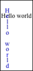

# SVG_New_vertical_text

>**SVG_New_vertical_text** ( *parentSVGObject* ; *text* {; *x* {; *y* {; *font* {; *size* {; *style* {; *alignment* {; *color* {; *rotation*}}}}}}}} )  -> Function result

| Parameter | Type |  | Description |
| --- | --- | --- | --- |
| parentSVGObject | SVG_Ref | &#8594; | Reference of parent element |
| text | Text | &#8594; | Text to insert |
| x | Longint | &#8594; | Coordinate on X axis |
| y | Longint | &#8594; | Coordinate on Y axis |
| font | String | &#8594; | Font name |
| size | Integer | &#8594; | Size of characters in points |
| style | Integer | &#8594; | Style of characters |
| alignment | Integer | &#8594; | Alignment |
| color | String | &#8594; | Text color |
| rotation | Longint | &#8594; | Angle of rotation of text |
| Function result | SVG_Ref | &#8592; | Reference of SVG text object |


#### Description 

The SVG\_New\_vertical\_text command inserts the text of text vertically in the SVG container designated by *parentSVGObject* and returns its reference. If *parentSVGObject* is not an SVG document, an error is generated.

The optional *x* and *y* parameters can be used to specify the position on the X and Y axis of the bottom left corner of the first character of text.

The optional *font* and *size* parameters can be used to specify the font and its size, in points, to be used. When these parameters are not passed, the text will be written in Times New Roman 12 pt.

The optional *style* parameter gives the character style used. In this parameter, you must pass one of the following styles, or a combination of several of these values:

> 0 = Plain  
> 1 = Bold  
> 2 = Italic  
> 4 = Underline  
> 8 = Strikethrough

The optional *alignment* parameter can be used to set the type of alignment applied to the text drawn. You can pass on eof the following values:

> 2 = Align left  
> 3 = Center  
> 4 = Align right

The optional *color* parameter contains the name of the font color. (For more information about colors, please refer to the ”*Colors and Gradients*” section).

The optional *rotation* parameter can be used to specify the rotation to be applied to the text.

#### Example 



```4d
 $SVG:=SVG_New
 $textID:=SVG_New_text($SVG;"Hello world";10;12)
 $textID:=SVG_New_vertical_text($SVG;"Hello world";22;3;"";-1;-1;Center;"blue")
```

#### See also 

[SVG\_New\_text](SVG%5FNew%5Ftext.md)  
[SVG\_New\_tspan](SVG%5FNew%5Ftspan.md)  