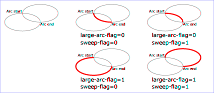

# SVG_PATH_ARC

>**SVG_PATH_ARC** ( *parentSVGObject* ; *xRadius* ; *yRadius* ; *x* ; *y* {; *rotation* {; *arcpath*}} )

| Parameter | Type |  | Description |
| --- | --- | --- | --- |
| parentSVGObject | SVG_Ref | &#8594; | Reference of path element |
| xRadius | Longint | &#8594; | Radius of ellipse on X axis |
| yRadius | Longint | &#8594; | Radius of ellipse on Y axis |
| x | Longint | &#8594; | Coordinate on X axis of destination point |
| y | Longint | &#8594; | Coordinate on Y axis of destination point |
| rotation | Longint | &#8594; | Value of rotation |
| arcpath | Longint | &#8594; | Sets the way the arc will be drawn |

#### Description 

The SVG\_PATH\_ARC command draws an elliptical arc, from the current point to the point (*x*, *y*), at the end of the path referenced by *parentSVGObject*. If *parentSVGObject* is not a path reference (‘path’ element), an error is generated.

The size and orientation of the ellipse are set by two radii (*xRadius*, *yRadius*) and a *rotation* value on the X axis that indicates the rotation of the ellipse as a whole with respect to the current coordinate system.

The optional *arcpath* parameter can be used to apply a combination of constraints which will determine how the arc will be drawn. The large-arc-flag constraint is used to choose (or not) the larger of the two possible arcs (greater than 180°) and the sweep-flag constraint chooses the direction it will be drawn (positive angle or negative angle).

The following values, representing the four possible combinations of the two constraints, can be passed:

* 0: large-arc-flag = 0, sweep-flag = 1
* 1: large-arc-flag = 1, sweep-flag = 0
* 2: large-arc-flag = 0, sweep-flag = 0
* 3: large-arc-flag = 1, sweep-flag = 1

When large-arc-flag is equal to 1, the larger arc is drawn (and the smaller when it is equal to 0). When sweep-flag is equal to 1, the arc is drawn at a positive angle (and at a negative angle when it is equal to 0).

The following drawing illustrates the four possible combinations:  
  
By default, the value of arcpath is 0 (large-arc-flag=0, sweep-flag=1).

#### Example 

See the examples for the *SVG\_New\_path* command.

#### See also 

[SVG\_New\_arc](SVG_New_arc.md)  