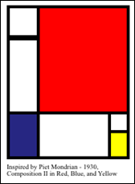

# SVG_SET_DEFAULT_BRUSHES

>**SVG_SET_DEFAULT_BRUSHES** ( *line* {; *background*} )

| Parameter | Type |  | Description |
| --- | --- | --- | --- |
| line | String | &#8594; | Color |
| background | String | &#8594; | Color |


#### Description 

The SVG\_SET\_DEFAULT\_BRUSHES command can be used to set the default colors used by the component.

The *line* parameter contains the new color that will be used for lines. The optional *background* parameter contains the new color to be used for drawing backgrounds.

You can pass an empty string in either of these parameters in order to reset the default value of the component; in other words, black for the lines and white for the background.

#### Example 

Like Mondrian…  


```4d
 $svg:=SVG_New
  //Set the default colors
 SVG_SET_DEFAULT_BRUSHES("black";"white")
  //4-point thick lines
 SVG_SET_STROKE_WIDTH($svg;4)
 $g:=SVG_New_group($svg)
 SVG_New_rect($g;2;2;40;40)
 SVG_New_rect($g;2;45;40;100)
 SVG_SET_FILL_BRUSH(SVG_New_rect($g;2;144;40;60);"midnightblue")
 SVG_SET_FILL_BRUSH(SVG_New_rect($g;42;2;120;142);"red")
 SVG_New_rect($g;42;144;95;60)
 SVG_New_rect($g;137;144;25;25)
 SVG_SET_FILL_BRUSH(SVG_New_rect($g;137;169;25;35);"yellow")
 SVG_SET_TRANSFORM_TRANSLATE($g;10;10)
  //Caption
 SVG_New_text($svg;"Inspired by Piet Mondrian - 1930,\rComposition II in Red, Blue, and Yellow";10;220;"";9)
```

#### See also 

[SVG\_GET\_DEFAULT\_BRUSHES](SVG_GET_DEFAULT_BRUSHES.md)  
[SVG\_SET\_STROKE\_BRUSH](SVG_SET_STROKE_BRUSH.md)  