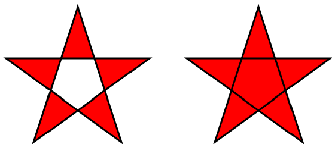

# SVG_SET_FILL_RULE

>**SVG_SET_FILL_RULE** ( *svgObject* ; *fillRule* )

| Parameter | Type |  | Description |
| --- | --- | --- | --- |
| svgObject | SVG_Ref | &#x1F852; | Reference of SVG element |
| fillRule | Text | &#x1F852; | Mode for filling object |


#### Description 

The SVG\_SET\_FILL\_RULE command is used to specify the fill rule for the SVG object designated by *svgObject*. An error is generated if *svgObject* is not a valid reference. 

The *fillRule* parameter must contain one of the following values: "nonzero", "evenodd" or "inherit". Otherwise, an error is generated.

**See Also:** *http://www.w3.org/TR/SVG/painting.html#FillRuleProperty*

#### Example 

Illustration of filling modes:  


```4d
  //Creating a path with the 'evenodd' fill rule
 $Dom_path:=SVG_New_path($Dom_SVG;250;75)
 SVG_PATH_LINE_TO($Dom_path;323;301;131;161;369;161;177;301)
 SVG_PATH_CLOSE($Dom_path)
 SVG_SET_FILL_BRUSH($Dom_path;"red")
 SVG_SET_STROKE_WIDTH($Dom_path;3)
 SVG_SET_FILL_RULE($Dom_path;"evenodd")
 
  //Creating a similar object with the 'nonzero' fill rule
 $Dom_path:=SVG_New_path($Dom_SVG;250;75)
 SVG_PATH_LINE_TO($Dom_path;323;301;131;161;369;161;177;301)
 SVG_PATH_CLOSE($Dom_path)
 SVG_SET_FILL_BRUSH($Dom_path;"red")
 SVG_SET_STROKE_WIDTH($Dom_path;3)
 SVG_SET_FILL_RULE($Dom_path;"nonzero")
  //Horizontal movement
 SVG_SET_TRANSFORM_TRANSLATE($Dom_path;300)
```
