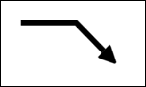
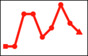

# SVG_SET_MARKER

>**SVG_SET_MARKER** ( *svgObject* ; *id* {; *position*} )

| Parameter | Type |  | Description |
| --- | --- | --- | --- |
| svgObject | SVG_Ref | &#x1F852; | Reference of SVG element |
| id | String | &#x1F852; | Name of marker |
| position | String | &#x1F852; | Position of marker |


#### Description 

The **SVG\_SET\_MARKER** command can be used to associate a marker with the object having the *svgObject* reference or to remove an existing marker. If *svgObject* is not the reference of a 'line', 'path', 'polyline' or 'polygon' element, an error is generated. If the attribute already exists, its value is replaced.

The *id* parameter is the name of the marker element to be used as specified by the *SVG\_Define\_marker* command. If this name does not exist, an error is generated.   
In order to remove an existing marker, pass "none" or an empty string in the *id* parameter. 

The optional *position* parameter can be used to set the position of the marker with respect to the object. It is possible to place different markers (if desired) at the beginning, end or any other peak of a path. The values may be as follows:

* *start* to place a marker at the beginning of the path
* *end* to place a marker at the end of the path
* *middle* to place a marker at each peak other than at the beginning and end.
* *all* to place markers at all peaks of the path.  
If this parameter is omitted, the marker will be placed at the end of the path.

#### Example 1 

Draw an arrow:  


```4d
 $SVG:=SVG_New
  //Set the arrow
 $arrow:=SVG_Define_marker($SVG;"arrow";0;5;4;3;-1)
 SVG_SET_VIEWBOX($arrow;0;0;10;10)
 $path:=SVG_New_path($arrow;0;0)
 SVG_SET_FILL_BRUSH($path;"black")
 SVG_PATH_LINE_TO($path;10;5)
 SVG_PATH_LINE_TO($path;0;10)
 SVG_PATH_CLOSE($path)
 
 $line:=SVG_New_path($SVG;100;75)
 SVG_SET_STROKE_WIDTH($line;10)
 SVG_PATH_LINE_TO($line;200;75)
 SVG_PATH_LINE_TO($line;250;125)
  //Put an arrow at the end of a path
 SVG_SET_MARKER($line;" arrow ")
```

#### Example 2 

Draw a diagram with different markers at the beginning and end:  
 

```4d
 $SVG:=SVG_New
 SVG_SET_DEFAULT_BRUSHES("red";"red")
 
  //Set a circle to mark the points
 $point:=SVG_Define_marker($SVG;"pointMarker";2;2;3;3)
 SVG_SET_VIEWBOX($point;0;0;4;4)
 SVG_New_circle($point;2;2;1)
 
  //Set a square for the starting point
 $start:=SVG_Define_marker($SVG;"startMarker";1;1;2;2)
 SVG_New_rect($start;0;0;2;2)
 
  //Set a triangle for the end point
 $end:=SVG_Define_marker($SVG;"endMarker";5;5;3;3;60)
 SVG_SET_VIEWBOX($end;0;0;10;10)
 SVG_New_regular_polygon($end;10;3)
 
 ARRAY LONGINT($tX;0)
 ARRAY LONGINT($tY;0)
  //X axis
 For($Lon_i;0;200;20)
    APPEND TO ARRAY($tX;$Lon_i+10)
 End for
  //Data
 APPEND TO ARRAY($tY;100)
 APPEND TO ARRAY($tY;100)
 APPEND TO ARRAY($tY;30)
 APPEND TO ARRAY($tY;30)
 APPEND TO ARRAY($tY;80)
 APPEND TO ARRAY($tY;60)
 APPEND TO ARRAY($tY;10)
 APPEND TO ARRAY($tY;40)
 APPEND TO ARRAY($tY;50)
 APPEND TO ARRAY($tY;70)
 $line:=SVG_New_polyline_by_arrays($SVG;->$tX;->$tY;"red";"none";5)
  //Arrange the markers:
 SVG_SET_MARKER($line;"startMarker";"start")
 SVG_SET_MARKER($line;"pointMarker";"middle")
 SVG_SET_MARKER($line;"endMarker";"end")
```

#### See also 

[SVG\_Define\_marker](SVG%5FDefine%5Fmarker.md)  