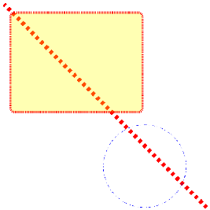

# SVG_SET_STROKE_DASHARRAY

>**SVG_SET_STROKE_DASHARRAY** ( *svgObject* ; *dash* {; *value*}{; *value2* ; ... ; *valueN*} )

| Parameter | Type |  | Description |
| --- | --- | --- | --- |
| svgObject | SVG_Ref | &#x1F852; | Reference of SVG element |
| dash | Real | &#x1F852; | Length of first dash |
| value | Longint | &#x1F852; | Length of spaces and dashes |


#### Description 

The SVG\_SET\_STROKE\_DASHARRAY command is used to set the pattern of dashes and gaps used to outline the path of the SVG object passed in *svgObject*. If *svgObject* is not a valid SVG reference, an error is generated.

The whole value of the *dash* parameter indicates the length of the first dash of the dotted pattern. If the *value* parameters are omitted, the dotted line will consists of a series of dashes and gaps of the same length.

The decimal value of the *dash* parameter, if it is not null, indicates the distance into the pattern from which the dashes will start.

If *dash* is 0, the dotted pattern is removed.

The *value* parameters alternately specify the lengths of the gaps and dashes that follow the first dash. If an odd number of values is given (including the first dash), the list of values is repeated until it produces an even number of values.

**See Also:** *http://www.w3.org/TR/SVG/painting.html#StrokeProperties*

#### Example 

Illustrations of a dotted line path:  


```4d
  //Line
 $Dom_line:=SVG_New_line($Dom_SVG;10;10;500;500)
 SVG_SET_STROKE_WIDTH($Dom_line;10)
 SVG_SET_STROKE_DASHARRAY($Dom_line;8,099)
 SVG_SET_STROKE_BRUSH($Dom_line;"red")
 
  //Rectangle
 $Dom_rect:=SVG_New_rect($Dom_SVG;25;30;320;240;10;10;"red";"yellow:30")
 SVG_SET_STROKE_WIDTH($Dom_rect;5)
 SVG_SET_STROKE_DASHARRAY($Dom_rect;2)
 
  //Circle
 $Dom_circle:=SVG_New_circle($Dom_SVG;350;400;100;"blue";"none")
 SVG_SET_STROKE_DASHARRAY($Dom_circle;2;4;6;8)
```
