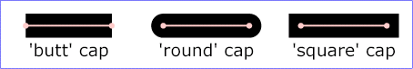

# SVG_SET_STROKE_LINECAP

>**SVG_SET_STROKE_LINECAP** ( *svgObject* ; *mode* )

| Parameter | Type |  | Description |
| --- | --- | --- | --- |
| svgObject | SVG_Ref | &#x1F852; | Reference of SVG element |
| mode | String | &#x1F852; | Rendering mode |

#### Description 

The SVG\_SET\_STROKE\_LINECAP command can be used to specify the form of the path ends of the SVG object having the *svgObject* reference. If this attribute already exists, its value is replaced by the value passed as parameter.

The *mode* parameter must contain one of the following strings, handled by SVG:

* *butt* (default): standard
* *round*
* *square*
* *inherit*: inherited from parent object

  
If the *mode* parameter contains any other value, an error is generated.

#### See also 

[SVG\_SET\_STROKE\_LINEJOIN](SVG%5FSET%5FSTROKE%5FLINEJOIN.md)  