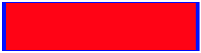
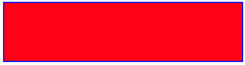

# SVG_SET_STROKE_VECTOR_EFFECT

>**SVG_SET_STROKE_VECTOR_EFFECT** ( *svgObj* {; *vectorEffect*} )

| Parameter | Type |  | Description |
| --- | --- | --- | --- |
| svgObj | SVG_Ref | &#x1F852; | Reference of SVG element |
| vectorEffect | String | &#x1F852; | "non-scaling-stroke", "none", "inherit" |


#### Description 

The **SVG\_SET\_STROKE\_VECTOR\_EFFECT** command sets the vector-effect attribute for the lines of the *svgObj*. The vector-effect attribute specifies the behavior of an object's stroke if the object is transformed, for example by zooming in or out. 

In the *svgObj* parameter, pass a reference to the SVG element whose vector-effect attribute will be set. If *svgObj* does not reference an SVG element, an error is generated. If the vector-effect attribute has already been defined, its value is replaced by the *vectorEffect* parameter.

The optional *vectorEffect* parameter indicates the value to be used for the attribute. The following values are available:

| **vectorEffect**     | **Description**                                                            |
| -------------------- | -------------------------------------------------------------------------- |
| "non-scaling-stroke" | Stroke (line) width is not dependant on the transformations of the element |
| "none"               | No vector effect is applied                                                |
| "inherit"            | The value of the element's parent is used                                  |

If *vectorEffect* is omitted, the vector-effect attribute is removed (equivalent to "none"). 

#### Example 

The following code creates a rectangle and resizes it:

```4d
 var $Dom_rect;$Dom_svg : Text
 $Dom_svg:=SVG_New
 $Dom_rect:=SVG_New_rect($Dom_svg;10;10;100;100;0;0;"blue";"red")
 SVG_SET_STROKE_WIDTH($Dom_rect;2;"px")
 
  // Redimension
 SVG_SET_TRANSFORM_SCALE($Dom_rect;4;1)
```

By default, line thickness is modified: 



To resize without changing line thickness, add **SVG\_SET\_STROKE\_VECTOR\_EFFECT**:

```4d
 var $Dom_rect;$Dom_svg : Text
 $Dom_svg:=SVG_New
 $Dom_rect:=SVG_New_rect($Dom_svg;10;10;100;100;0;0;"blue";"red")
 SVG_SET_STROKE_WIDTH($Dom_rect;2;"px")
 
  // Redimension
 SVG_SET_TRANSFORM_SCALE($Dom_rect;4;1)
 
  // Set non-scalling
 SVG_SET_STROKE_VECTOR_EFFECT($Dom_rect;"non-scaling-stroke")
```

The line thickness is not modified:


