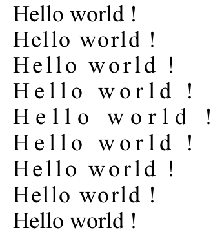

# SVG_SET_TEXT_KERNING

>**SVG_SET_TEXT_KERNING** ( *svgObject* ; *kerning* {; *unit*} )

| Parameter | Type |  | Description |
| --- | --- | --- | --- |
| svgObject | SVG_Ref | &#8594; | Reference of text element |
| kerning | Real | &#8594; | Letter spacing |
| unit | Text | &#8594; | Unit of spacing value |


#### Description 

The *SVG\_Get\_text* command is used to modify the kerning for the text object designated by *svgObject*. If *svgObject* is not an SVG text object, an error is generated. 

The optional *unit* parameter is used to specify the unit of the kerning value. The default value is "%".

If *kerning* is -1, the kerning value is set to 'auto'.

**Note:** Under Windows, the implementation is limited to text from left to right and top to bottom (disabled for right to left text) and to the 'text' and 'tspan' elements; under Mac OS, support is not limited.

**See Also:** *http://www.w3.org/TR/SVG/text.html#KerningProperty*

#### Example 

Examples of kerning variations:  


```4d
  //Reference
 $Dom_text:=SVG_New_text($Dom_SVG;"Hello world !";20;40;"";36)
 $Dom_text:=SVG_New_text($Dom_SVG;"Hello world !";20;80;"";36)
 SVG_SET_TEXT_KERNING($Dom_text;0,5)
 $Dom_text:=SVG_New_text($Dom_SVG;"Hello world !";20;120;"";36)
 SVG_SET_TEXT_KERNING($Dom_text;1)
 $Dom_text:=SVG_New_text($Dom_SVG;"Hello world !";20;160;"";36)
 SVG_SET_TEXT_KERNING($Dom_text;1,5)
 $Dom_text:=SVG_New_text($Dom_SVG;"Hello world !";20;200;"";36)
 SVG_SET_TEXT_KERNING($Dom_text;2)
 $Dom_text:=SVG_New_text($Dom_SVG;"Hello world !";20;240;"";36)
 SVG_SET_TEXT_KERNING($Dom_text;1,5)
 $Dom_text:=SVG_New_text($Dom_SVG;"Hello world !";20;280;"";36)
 SVG_SET_TEXT_KERNING($Dom_text;1)
 $Dom_text:=SVG_New_text($Dom_SVG;"Hello world !";20;320;"";36)
 SVG_SET_TEXT_KERNING($Dom_text;0,5)
 $Dom_text:=SVG_New_text($Dom_SVG;"Hello world !";20;360;"";36)
 SVG_SET_TEXT_KERNING($Dom_text;0)
```

#### See also 

[SVG\_SET\_TEXT\_LETTER\_SPACING](SVG_SET_TEXT_LETTER_SPACING.md)  