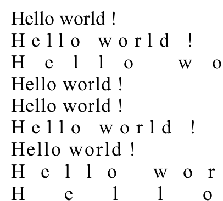

# SVG_SET_TEXT_LETTER_SPACING

>**SVG_SET_TEXT_LETTER_SPACING** ( *svgObject* ; *spacing* {; *unit*} )

| Parameter | Type |  | Description |
| --- | --- | --- | --- |
| svgObject | SVG_Ref | &#x1F852; | Reference of text element |
| spacing | Real | &#x1F852; | Letter spacing |
| unit | Text | &#x1F852; | Unit of value |


#### Description 

The SVG\_SET\_TEXT\_LETTER\_SPACING command is used to modify the letter spacing for the text object designated by *svgObject* in addition to the spacing due to the 'kerning' property. If *svgObject* is not an SVG text object, an error is generated. 

The optional *unit* parameter is used to specify the unit of the spacing value. The default value is "%".

If *spacing* is -1, the spacing value is set to 'normal'.

**See Also:** *http://www.w3.org/TR/SVG/text.html#LetterSpacingProperty*

#### Example 

Examples of spacing variations:  


```4d
  //Reference
 $Dom_text:=SVG_New_text($Dom_SVG;"Hello world !";20;40;"";36)
 
 $Dom_text:=SVG_New_text($Dom_SVG;"Hello world !";20;80;"";36)
 SVG_SET_TEXT_LETTER_SPACING($Dom_text;1)
 $Dom_text:=SVG_New_text($Dom_SVG;"Hello world !";20;120;"";36)
 SVG_SET_TEXT_LETTER_SPACING($Dom_text;1;"em")
 $Dom_text:=SVG_New_text($Dom_SVG;"Hello world !";20;160;"";36)
 SVG_SET_TEXT_LETTER_SPACING($Dom_text;1;"px")
 $Dom_text:=SVG_New_text($Dom_SVG;"Hello world !";20;200;"";36)
 SVG_SET_TEXT_LETTER_SPACING($Dom_text;1;"pt")
 $Dom_text:=SVG_New_text($Dom_SVG;"Hello world !";20;240;"";36)
 SVG_SET_TEXT_LETTER_SPACING($Dom_text;1;"pc")
 $Dom_text:=SVG_New_text($Dom_SVG;"Hello world !";20;280;"";36)
 SVG_SET_TEXT_LETTER_SPACING($Dom_text;1;"mm")
 $Dom_text:=SVG_New_text($Dom_SVG;"Hello world !";20;320;"";36)
 SVG_SET_TEXT_LETTER_SPACING($Dom_text;1;"cm")
 $Dom_text:=SVG_New_text($Dom_SVG;"Hello world !";20;360;"";36)
 SVG_SET_TEXT_LETTER_SPACING($Dom_text;1;"in")
```

#### See also 

[SVG\_SET\_TEXT\_KERNING](SVG%5FSET%5FTEXT%5FKERNING.md)  