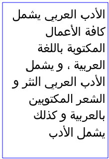

# SVG_SET_TEXT_WRITING_MODE

>**SVG_SET_TEXT_WRITING_MODE** ( *svgObject* ; *writingMode* )

| Parameter | Type |  | Description |
| --- | --- | --- | --- |
| svgObject | SVG_Ref | &#8594; | Reference of text element |
| writingMode | Text | &#8594; | Direction of writing |


#### Description 

The SVG\_SET\_TEXT\_WRITING\_MODE command is used to set whether the writing direction for the text object designated by *svgObject* will be left to right, right to left or bottom to top. If *svgObject* is not an SVG text object, an error is generated. 

The *writingMode* parameter can have one of the following values: "lr-tb", "rl-tb", "tb-rl", "lr", "rl", "tb" or "inherit ". Otherwise, an error is generated.

#### Example 

Writing from right to left:  


```4d
  //Frame
 SVG_New_rect($Dom_SVG;5;5;210;310;0;0;"blue";"none")
 
  //Text
 $Dom_text:=SVG_New_textArea($Dom_SVG;$Txt_sample;10;10;200;300;"Baghdad 'Arial Unicode MS'";25)
 SVG_SET_TEXT_WRITING_MODE($Dom_text;"rl")
```
