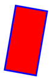

# SVG_SET_TRANSFORM_ROTATE

>**SVG_SET_TRANSFORM_ROTATE** ( *svgObject* ; *angle* {; *x* ; *y*} )

| Parameter | Type |  | Description |
| --- | --- | --- | --- |
| svgObject | SVG_Ref | &#8594; | Reference of SVG element |
| angle | Longint | &#8594; | Angle of rotation |
| x | Longint | &#8594; | Coordinate on X axis of center of rotation |
| y | Longint | &#8594; | Coordinate on Y axis of center of rotation |


#### Description 

The SVG\_SET\_TRANSFORM\_ROTATE command applies a rotation of the value angle in degrees to the SVG object having the *objectRef* reference.  
The *angle* of rotation is expected in degrees; the rotation is made clockwise.

If the optional *x* and *y* parameters are not passed, the rotation is carried out with respect to the origin of the current user coordinate system.If these parameters are provided, the rotation is carried out with respect to the coordinates passed (*x*, *y*).

#### Example 



```4d
 svgRef:=SVG_New
  //Draw a red rectangle with a blue border
 $rec:=SVG_New_rect($svg;150;50;200;400;0;0;"blue";"red";10)
  //Apply a rotation of 10° clockwise with respect to the center
 SVG_SET_TRANSFORM_ROTATE($rec;370;175;225)
```

#### See also 

[SVG\_SET\_TRANSFORM\_FLIP](SVG%5FSET%5FTRANSFORM%5FFLIP.md)  