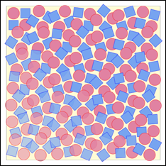

# SVG_Use

>**SVG_Use** ( *parentSVGObjec* ; *id* {; *x* ; *y* ; *width* ; *height* {; *mode*}} ) -> Function result

| Parameter | Type |  | Description |
| --- | --- | --- | --- |
| parentSVGObjec | SVG_Ref | &#8594; | Reference of parent element |
| id | String | &#8594; | Name of symbol |
| x | Longint | &#8594; | X position of viewbox |
| y | Longint | &#8594; | Y position of viewbox |
| width | Longint | &#8594; | Width of viewbox |
| height | Longint | &#8594; | Height of viewbox |
| mode | String | &#8594; | Adjustment to viewbox |
| Function result | SVG_Ref | &#8592; | SVG object reference |


#### Description 

The SVG\_Use command places an occurrence of the symbol in the SVG container designated by *parentSVGObject* and returns its reference. If *parentSVGObject* is not an SVG document or if *id* is not the object name of an SVG document, an error is generated.

A symbol is used to specify graphic objects; it is never rendered directly but may be instantiated using the SVG\_Use command.

The *id* parameter specifies the name of the symbol.

The optional *x*, *y*, *width* and *height* parameters specify the viewbox rectangle ('viewBox' attribute).

The optional *mode* parameter can be used to indicate if the graphic must be fitted, and how so, to the size of the viewbox. (see the *SVG\_New* command).

#### Example 

Specify a graphic composed of two red circles and two blue squares. Then use this graphic in a loop to create 36 occurrences with varying positions, opacity and rotation of the original graphic.  


```4d
 $SVG:=SVG_New
  //Draw a background
 SVG_New_rect($SVG;20;20;650;650;0;0;"gray";"lemonchiffon")
  //Specify a symbol composed of 2 squares and 2 circles
 $Symbol:=SVG_Define_symbol($SVG;"MySymbol";0;0;110;110;"true")
 SVG_New_circle($Symbol;30;30;25;"red";"palevioletred")
 SVG_New_rect($Symbol;10;60;40;40;0;0;"blue";"cornflowerblue")
 SVG_New_rect($Symbol;60;10;40;40;0;0;"blue";"cornflowerblue")
 SVG_New_circle($Symbol;80;80;25;"red";"palevioletred")
  //In a group…
 $g:=SVG_New_group($SVG)
  //…positioned 20 units from the top left corner of the document…
 SVG_SET_TRANSFORM_TRANSLATE($g;20;20)
  //…place 36 patterns by varying the position, opacity and rotation
 For($x;0;540;90) //6 columns
    For($y;0;540;90) //6 rows
       $use:=SVG_Use($g;"MySymbol";$x;$y;110;110)
       SVG_SET_OPACITY($use;100-($y/12)+($x/12)
       SVG_SET_TRANSFORM_ROTATE($use;($x*(18/50))+($y*(18/50));($x+55);($y+55))
    End for
 End for
```

#### See also 

[SVG\_Define\_symbol](SVG_Define_symbol.md)  