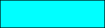
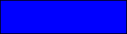
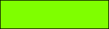
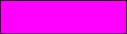
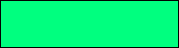
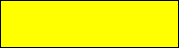

#  SVG (Names)

| Constant | Type | Value | Comment |
| --- | --- | --- | --- |
| color SVG aliceblue | String | aliceblue |  |
| color SVG antiquewhite | String | antiquewhite |  |
| color SVG aqua | String | aqua |  |
| color SVG aquamarine | String | aquamarine |  |
| color SVG azure | String | azure |  |
| color SVG beige | String | beige |  |
| color SVG bisque | String | bisque |  |
| color SVG black | String | black |  |
| color SVG blanchedalmond | String | blanchedalmond |  |
| color SVG blue | String | blue |  |
| color SVG blueviolet | String | blueviolet |  |
| color SVG brown | String | brown |  |
| color SVG burlywood | String | burlywood |  |
| color SVG cadetblue | String | cadetblue |  |
| color SVG chartreuse | String | chartreuse |  |
| color SVG chocolate | String | chocolate |  |
| color SVG coral | String | coral |  |
| color SVG cornflowerblue | String | cornflowerblue |  |
| color SVG cornsilk | String | cornsilk |  |
| color SVG crimson | String | crimson |  |
| color SVG cyan | String | cyan |  |
| color SVG darkblue | String | darkblue |  |
| color SVG darkcyan | String | darkcyan |  |
| color SVG darkgoldenrod | String | darkgoldenrod |  |
| color SVG darkgray | String | darkgray |  |
| color SVG darkgreen | String | darkgreen |  |
| color SVG darkgrey | String | darkgrey |  |
| color SVG darkkhaki | String | darkkhaki |  |
| color SVG darkmagenta | String | darkmagenta |  |
| color SVG darkolivegreen | String | darkolivegreen |  |
| color SVG darkorange | String | darkorange |  |
| color SVG darkorchid | String | darkorchid |  |
| color SVG darkred | String | darkred |  |
| color SVG darksalmon | String | darksalmon |  |
| color SVG darkseagreen | String | darkseagreen |  |
| color SVG darkslateblue | String | darkslateblue |  |
| color SVG darkslategray | String | darkslategray |  |
| color SVG darkslategrey | String | darkslategrey |  |
| color SVG darkturquoise | String | darkturquoise |  |
| color SVG darkviolet | String | darkviolet |  |
| color SVG deeppink | String | deeppink |  |
| color SVG deepskyblue | String | deepskyblue |  |
| color SVG dimgray | String | dimgray |  |
| color SVG dimgrey | String | dimgrey |  |
| color SVG dodgerblue | String | dodgerblue |  |
| color SVG firebrick | String | firebrick |  |
| color SVG floralwhite | String | floralwhite |  |
| color SVG forestgreen | String | forestgreen |  |
| color SVG fuchsia | String | fuchsia |  |
| color SVG gainsboro | String | gainsboro |  |
| color SVG ghostwhite | String | ghostwhite |  |
| color SVG gold | String | gold |  |
| color SVG goldenrod | String | goldenrod |  |
| color SVG gray | String | gray |  |
| color SVG green | String | green |  |
| color SVG greenyellow | String | greenyellow |  |
| color SVG grey | String | grey |  |
| color SVG honeydew | String | honeydew |  |
| color SVG hotpink | String | hotpink |  |
| color SVG indianred | String | indianred |  |
| color SVG indigo | String | indigo |  |
| color SVG ivory | String | ivory |  |
| color SVG khaki | String | khaki |  |
| color SVG lavender | String | lavender |  |
| color SVG lavenderblush | String | lavenderblush |  |
| color SVG lawngreen | String | lawngreen |  |
| color SVG lemonchiffon | String | lemonchiffon |  |
| color SVG lightblue | String | lightblue |  |
| color SVG lightcoral | String | lightcoral |  |
| color SVG lightcyan | String | lightcyan |  |
| color SVG lightgoldenrodyellow | String | lightgoldenrodyellow |  |
| color SVG lightgray | String | lightgray |  |
| color SVG lightgreen | String | lightgreen |  |
| color SVG lightgrey | String | lightgrey |  |
| color SVG lightpink | String | lightpink |  |
| color SVG lightsalmon | String | lightsalmon |  |
| color SVG lightseagreen | String | lightseagreen |  |
| color SVG lightskyblue | String | lightskyblue |  |
| color SVG lightslategray | String | lightslategray |  |
| color SVG lightslategrey | String | lightslategrey |  |
| color SVG lightsteelblue | String | lightsteelblue |  |
| color SVG lightyellow | String | lightyellow |  |
| color SVG lime | String | lime |  |
| color SVG limegreen | String | limegreen |  |
| color SVG linen | String | linen |  |
| color SVG magenta | String | magenta |  |
| color SVG maroon | String | maroon |  |
| color SVG mediumaquamarine | String | mediumaquamarine |  |
| color SVG mediumblue | String | mediumblue |  |
| color SVG mediumorchid | String | mediumorchid |  |
| color SVG mediumpurple | String | mediumpurple |  |
| color SVG mediumseagreen | String | mediumseagreen |  |
| color SVG mediumslateblue | String | mediumslateblue |  |
| color SVG mediumspringgreen | String | mediumspringgreen |  |
| color SVG mediumturquoise | String | mediumturquoise |  |
| color SVG mediumvioletred | String | mediumvioletred |  |
| color SVG midnightblue | String | midnightblue |  |
| color SVG mintcream | String | mintcream |  |
| color SVG mistyrose | String | mistyrose |  |
| color SVG moccasin | String | moccasin |  |
| color SVG navajowhite | String | navajowhite |  |
| color SVG navy | String | navy |  |
| color SVG oldlace | String | oldlace |  |
| color SVG olive | String | olive |  |
| color SVG olivedrab | String | olivedrab |  |
| color SVG orange | String | orange |  |
| color SVG orangered | String | orangered |  |
| color SVG orchid | String | orchid |  |
| color SVG palegoldenrod | String | palegoldenrod |  |
| color SVG palegreen | String | palegreen |  |
| color SVG paleturquoise | String | paleturquoise |  |
| color SVG palevioletred | String | palevioletred |  |
| color SVG papyawhip | String | papyawhip |  |
| color SVG peachpuff | String | peachpuff |  |
| color SVG peru | String | peru |  |
| color SVG pink | String | pink |  |
| color SVG plum | String | plum |  |
| color SVG powderblue | String | powderblue |  |
| color SVG purple | String | purple |  |
| color SVG red | String | red |  |
| color SVG rosybrown | String | rosybrown |  |
| color SVG royalblue | String | royalblue |  |
| color SVG saddlebrown | String | saddlebrown |  |
| color SVG salmon | String | salmon |  |
| color SVG sandybrown | String | sandybrown |  |
| color SVG seagreen | String | seagreen |  |
| color SVG seashell | String | seashell |  |
| color SVG sienna | String | sienna |  |
| color SVG silver | String | silver |  |
| color SVG skyblue | String | skyblue |  |
| color SVG slateblue | String | slateblue |  |
| color SVG slategray | String | slategray |  |
| color SVG slategrey | String | slategrey |  |
| color SVG snow | String | snow |  |
| color SVG springgreen | String | springgreen |  |
| color SVG steelblue | String | steelblue |  |
| color SVG tan | String | tan |  |
| color SVG teal | String | teal |  |
| color SVG thistle | String | thistle |  |
| color SVG tomato | String | tomato |  |
| color SVG turquoise | String | turquoise |  |
| color SVG violet | String | violet |  |
| color SVG wheat | String | wheat |  |
| color SVG white | String | white |  |
| color SVG whitesmoke | String | whitesmoke |  |
| color SVG yellow | String | yellow |  |
| color SVG yellowgreen | String | yellowgreen |  |

## See also

 [SVG Colors (RGB)](SVG%20Colors%20(RGB).md)
 [SVG Colors](SVG%20Colors.md)
