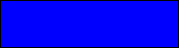
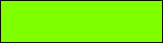
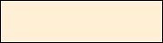
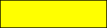

#  SVG Colors (RGB)

| Constant | Type | Value | Comment |
| --- | --- | --- | --- |
| color RGB aliceblue | Longint | 15792383 |  |
| color RGB antiquewhite | Longint | 16444375 |  |
| color RGB aqua | Longint | 65535 |  |
| color RGB aquamarine | Longint | 8388564 |  |
| color RGB azure | Longint | 15794175 |  |
| color RGB beige | Longint | 16119260 |  |
| color RGB bisque | Longint | 16770244 |  |
| color RGB black | Longint | 0   |  |
| color RGB blanchedalmond | Longint | 16772045 |  |
| color RGB blue | Longint | 255 |  |
| color RGB blueviolet | Longint | 9055202 |  |
| color RGB brown | Longint | 10824234 |  |
| color RGB burlywood | Longint | 14596231 |  |
| color RGB cadetblue | Longint | 6266528 |  |
| color RGB chartreuse | Longint | 8388352 |  |
| color RGB chocolate | Longint | 13789470 |  |
| color RGB coral | Longint | 16744272 |  |
| color RGB cornflowerblue | Longint | 6591981 |  |
| color RGB cornsilk | Longint | 16775388 |  |
| color RGB crimson | Longint | 14423100 |  |
| color RGB cyan | Longint | 65535 |  |
| color RGB darkblue | Longint | 139 |  |
| color RGB darkcyan | Longint | 35723 |  |
| color RGB darkgoldenrod | Longint | 12092939 |  |
| color RGB darkgray | Longint | 11119017 |  |
| color RGB darkgreen | Longint | 25600 |  |
| color RGB darkgrey | Longint | 11119017 |  |
| color RGB darkkhaki | Longint | 12433259 |  |
| color RGB darkmagenta | Longint | 9109643 |  |
| color RGB darkolivegreen | Longint | 5597999 |  |
| color RGB darkorange | Longint | 16747520 |  |
| color RGB darkorchid | Longint | 10040012 |  |
| color RGB darkred | Longint | 9109504 |  |
| color RGB darksalmon | Longint | 15308410 |  |
| color RGB darkseagreen | Longint | 9419919 |  |
| color RGB darkslateblue | Longint | 4734347 |  |
| color RGB darkslategray | Longint | 3100495 |  |
| color RGB darkslategrey | Longint | 3100495 |  |
| color RGB darkturquoise | Longint | 52945 |  |
| color RGB darkviolet | Longint | 9699539 |  |
| color RGB deeppink | Longint | 16716947 |  |
| color RGB deepskyblue | Longint | 49151 |  |
| color RGB dimgray | Longint | 6908265 |  |
| color RGB dodgerblue | Longint | 2003199 |  |
| color RGB firebrick | Longint | 11673122 |  |
| color RGB forestgreen | Longint | 2263842 |  |
| color RGB fuchsia | Longint | 16711935 |  |
| color RGB gainsboro | Longint | 14474460 |  |
| color RGB ghostwhite | Longint | 16316671 |  |
| color RGB gold | Longint | 16766720 |  |
| color RGB goldenrod | Longint | 14329120 |  |
| color RGB gray | Longint | 8421504 |  |
| color RGB green | Longint | 32768 |  |
| color RGB greenyellow | Longint | 11403055 |  |
| color RGB grey | Longint | 8421504 |  |
| color RGB honeydew | Longint | 15794160 |  |
| color RGB hotpink | Longint | 16738740 |  |
| color RGB indianred | Longint | 13458524 |  |
| color RGB indigo | Longint | 4915330 |  |
| color RGB ivory | Longint | 16777200 |  |
| color RGB khaki | Longint | 15787660 |  |
| color RGB lavender | Longint | 15132410 |  |
| color RGB lavenderblush | Longint | 16773365 |  |
| color RGB lawngreen | Longint | 8190976 |  |
| color RGB lemonchiffon | Longint | 16775885 |  |
| color RGB lightblue | Longint | 11393254 |  |
| color RGB lightcoral | Longint | 1576136 |  |
| color RGB lightcyan | Longint | 14745599 |  |
| color RGB lightgoldenrodyellow | Longint | 16448210 |  |
| color RGB lightgray | Longint | 13882323 |  |
| color RGB lightgreen | Longint | 9498256 |  |
| color RGB lightgrey | Longint | 13882323 |  |
| color RGB lightpink | Longint | 16758465 |  |
| color RGB lightsalmon | Longint | 16752762 |  |
| color RGB lightseagreen | Longint | 2142890 |  |
| color RGB lightskyblue | Longint | 8900346 |  |
| color RGB lightslategray | Longint | 7833753 |  |
| color RGB lightslategrey | Longint | 7833753 |  |
| color RGB lightsteelblue | Longint | 11584734 |  |
| color RGB lightyellow | Longint | 16777184 |  |
| color RGB lime | Longint | 65280 |  |
| color RGB limegreen | Longint | 3329330 |  |
| color RGB linen | Longint | 16445670 |  |
| color RGB magenta | Longint | 16711935 |  |
| color RGB maroon | Longint | 8388608 |  |
| color RGB mediumaquamarine | Longint | 6737322 |  |
| color RGB mediumblue | Longint | 205 |  |
| color RGB mediumorchid | Longint | 12211667 |  |
| color RGB mediumpurple | Longint | 9662683 |  |
| color RGB mediumseagreen | Longint | 3978097 |  |
| color RGB mediumslateblue | Longint | 8087790 |  |
| color RGB mediumspringgreen | Longint | 64154 |  |
| color RGB mediumturquoise | Longint | 4772300 |  |
| color RGB mediumvioletred | Longint | 13047173 |  |
| color RGB midnightblue | Longint | 1644912 |  |
| color RGB mintcream | Longint | 16121850 |  |
| color RGB mistyrose | Longint | 16770273 |  |
| color RGB moccasin | Longint | 16770273 |  |
| color RGB navajowhite | Longint | 16768685 |  |
| color RGB navy | Longint | 128 |  |
| color RGB oldlace | Longint | 16643558 |  |
| color RGB olive | Longint | 8421376 |  |
| color RGB olivedrab | Longint | 7048739 |  |
| color RGB orange | Longint | 16753920 |  |
| color RGB orangered | Longint | 16729344 |  |
| color RGB orchid | Longint | 14315734 |  |
| color RGB palegoldenrod | Longint | 15657130 |  |
| color RGB palegreen | Longint | 10025880 |  |
| color RGB paleturquoise | Longint | 11529966 |  |
| color RGB palevioletred | Longint | 14381203 |  |
| color RGB papyawhip | Longint | 16773077 |  |
| color RGB peachpuff | Longint | 16767673 |  |
| color RGB peru | Longint | 13468991 |  |
| color RGB pink | Longint | 16761035 |  |
| color RGB plum | Longint | 14524637 |  |
| color RGB powderblue | Longint | 11591910 |  |
| color RGB purple | Longint | 8388736 |  |
| color RGB red | Longint | 16711680 |  |
| color RGB rosybrown | Longint | 12357519 |  |
| color RGB royalblue | Longint | 4286945 |  |
| color RGB saddlebrown | Longint | 9127187 |  |
| color RGB salmon | Longint | 16416882 |  |
| color RGB sandybrown | Longint | 16032864 |  |
| color RGB seagreen | Longint | 3050327 |  |
| color RGB seashell | Longint | 16774638 |  |
| color RGB sienna | Longint | 10506797 |  |
| color RGB silver | Longint | 12632256 |  |
| color RGB skyblue | Longint | 8900331 |  |
| color RGB slateblue | Longint | 6970061 |  |
| color RGB slategray | Longint | 7372944 |  |
| color RGB slategrey | Longint | 7372944 |  |
| color RGB snow | Longint | 16775930 |  |
| color RGB springgreen | Longint | 65407 |  |
| color RGB steelblue | Longint | 4620980 |  |
| color RGB tan | Longint | 13808780 |  |
| color RGB teal | Longint | 32896 |  |
| color RGB thistle | Longint | 14204888 |  |
| color RGB tomato | Longint | 16737095 |  |
| color RGB turquoise | Longint | 4251856 |  |
| color RGB violet | Longint | 15631086 |  |
| color RGB wheat | Longint | 16113331 |  |
| color RGB white | Longint | 16777215 |  |
| color RGB whitesmoke | Longint | 16119285 |  |
| color RGB yellow | Longint | 16776960 |  |
| color RGB yellowgreen | Longint | 10145074 |  |

## See also

 [SVG Colors (Names)](SVG%20Colors%20(Names).md)
 [SVG Colors](SVG%20Colors.md)
